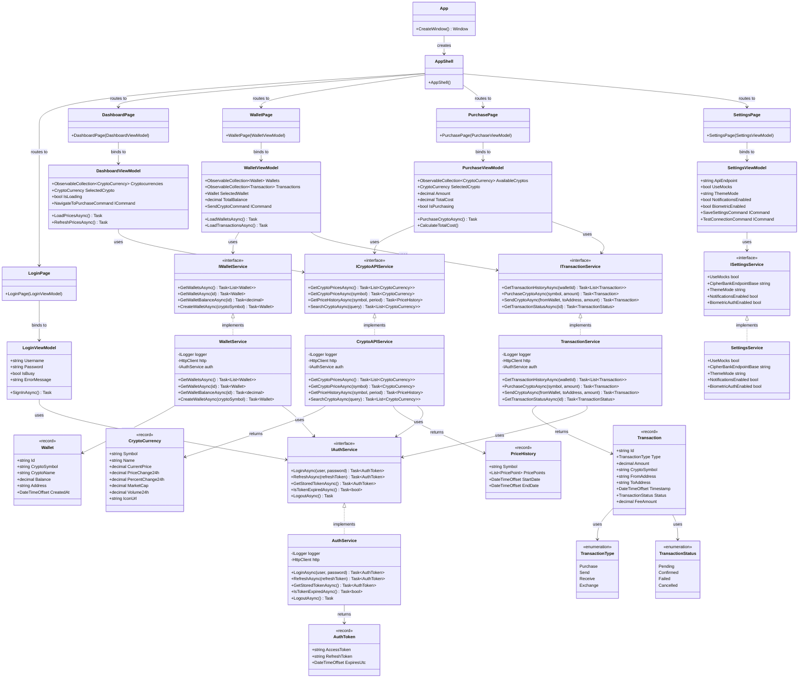

# CipherBank App - Future Architecture Plan

## Future Architecture Overview

### New Pages & Features

1. **Dashboard Page**
   - Real-time cryptocurrency price tracking
   - Market overview with price charts
   - Portfolio value summary
   - Quick navigation to purchase

2. **Wallet Page**
   - View all cryptocurrency wallets
   - Display balances for each wallet
   - Transaction history
   - Send/receive functionality

3. **Purchase Page**
   - Browse available cryptocurrencies
   - Select crypto and amount to purchase
   - Price calculation
   - Purchase confirmation via CipherBank API

4. **Settings Page**
   - API endpoint configuration
   - Mock mode toggle
   - Theme selection (Light/Dark)
   - Notification preferences
   - Biometric authentication settings

### New Services

1. **ICryptoAPIService / CryptoAPIService**
   - Fetch cryptocurrency prices and market data
   - Get price history for charts
   - Search cryptocurrencies

2. **IWalletService / WalletService**
   - Manage user wallets
   - Get wallet balances
   - Create new wallets

3. **ITransactionService / TransactionService**
   - Purchase cryptocurrency
   - Send/receive crypto
   - Transaction history
   - Transaction status tracking

4. **Enhanced ISettingsService**
   - Add theme mode
   - Notification preferences
   - Biometric authentication

### New Models

1. **CryptoCurrency**: Price and market data for cryptocurrencies
2. **Wallet**: User's cryptocurrency wallet information
3. **Transaction**: Transaction records with type and status
4. **PriceHistory**: Historical price data for charts
5. **TransactionType**: Enum for transaction types
6. **TransactionStatus**: Enum for transaction status

## Implementation Priority

1. **Phase 1**: Settings Page (enhance existing service)
2. **Phase 2**: Dashboard Page with CryptoAPIService
3. **Phase 3**: Wallet Page with WalletService
4. **Phase 4**: Purchase functionality with TransactionService
