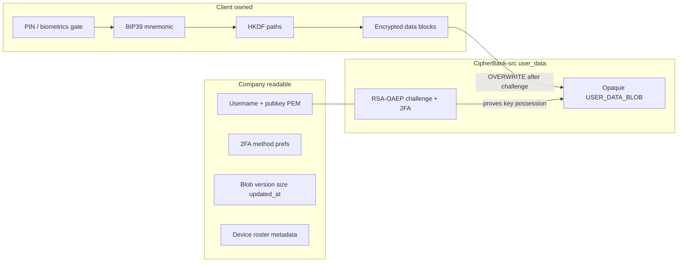
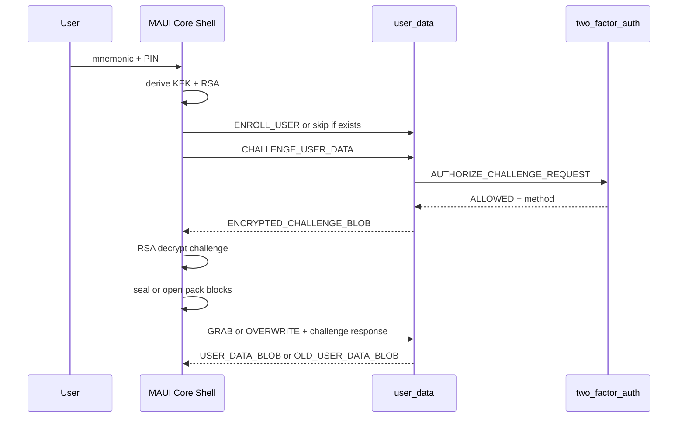

# Encrypted user-data blocks

**Status:** Design — Core KDF/pack + modular crypto + RSA enroll shipped; **IUserDataClient / Mock / TCP loopback transport** on `feat/userdata-client-wire`. Prefs sync migration remains follow-up.  
**Audience:** Core / Shell / CipherBank-src maintainers  
**Related code (today):** `Core/Custody/*`, `Core/Persist/UserPrefs.cs`, `Core/V1/PrefsWireDto.cs`, `Core/V1/PrefsSyncService.cs`  
**Related backend:** CipherBank-src `user_data` + `two_factor_auth` on branch `csp-create-user-module`  
**Operational map:** [`BUILD_LOG.md`](BUILD_LOG.md) · invoke surface: [`MAUI_FUNCTION_REF.md`](MAUI_FUNCTION_REF.md)

This document defines how the MAUI app stores user preferences and configs as a **series of client-encrypted data blocks**, durable on CipherBank-src’s opaque `USER_DATA_BLOB`, so a new device can restore them after BIP39 mnemonic recovery without exposing critical plaintext to company systems. A **minimal account profile** remains company-readable for enrollment, 2FA routing, and support metadata.

---

## 1. Purpose and non-goals

### Purpose

- Persist product prefs / selected app configs across devices.
- Keep vault/custody secrets and preference plaintext **client-owned**.
- Reuse the same mnemonic the user already needs to restore custody.
- Use the existing user_data wire protocol: ENROLL → CHALLENGE (+2FA) → GRAB / OVERWRITE.

### Non-goals

- Cloud backup of the mnemonic or PIN (offline file format remains `cipherbank-recovery-v1`).
- Giving CipherBank plaintext of prefs / configs / private keys.
- Replacing on-device SQLite as the working cache (local-first; cloud pack is durable sync).
- Implementing Core codecs, Shell wiring, or src handler changes in this design pass.
- Real EMAIL / SMS / TOTP delivery (document the hook; src 2FA may still stub `ALWAYS_ALLOW`).

---

## 2. Locked decisions

| Topic | Choice |
|-------|--------|
| Unlock material | BIP39 **mnemonic-derived** keys (same custody restore path) |
| Company-readable surface | **Minimal account only** — username/handle, enrolled public key PEM, 2FA method prefs, device-roster metadata, blob metadata |
| Backend transport | Opaque `USER_DATA_BLOB` on user_data (not plaintext product `GET/PUT /prefs`) |
| Challenge crypto | RSA-OAEP (SHA-256) as implemented by `UserData_Handler` today |
| Block crypto | AES-256-GCM under mnemonic-derived KEK (not PIN PBKDF2 / not device secret) |

---

## 3. Threat model and trust boundaries



### Client-owned (never plaintext on the wire or in company logs)

| Material | Notes |
|----------|-------|
| BIP39 mnemonic / entropy | Unlocks custody and rematerializes userdata keys |
| PIN / biometric unlock secrets | Local gate only (`PinService` hash; OS biometrics) |
| Device secret | Seals local custody blob; **not** used for cloud pack |
| RSA private key | Rematerialized from mnemonic; used only to answer challenges |
| Pack KEK | Rematerialized from mnemonic; seals/opens data blocks |
| Decrypted block payloads | Prefs, app_config, masked recipients, etc. |
| Full ACH / PAN / spend keys | Out of scope for this pack entirely |

### Company-readable (identity + metadata)

| Field | Why |
|-------|-----|
| Normalized username / handle | Account lookup (`USERNAME` on wire; stored with SHA-256 username hash as today) |
| Enrollment `PUBLIC_KEY_PEM` | Challenge encryption |
| Preferred / effective 2FA method | `EMAIL` \| `SMS` \| `AUTHENTICATOR` routing |
| Device roster metadata | Device id, label, platform, `last_seen` — no secrets |
| Blob metadata | Format id, `content_version`, byte length, `updated_at` |

### Server role

Durable opaque stash + enrollment identity + challenge gate:

1. 2FA authorize challenge issue.
2. RSA-OAEP encrypt random challenge to enrolled public key.
3. Verify Base64-decoded challenge response via SHA-256 + TTL.
4. Return or overwrite opaque `USER_DATA_BLOB` without interpreting contents.

Server-side column encryption (`TransformedSecureString`) is an **at-rest implementation detail** for DB fields; it is **not** the client privacy boundary. Clients must assume operators with DB access can obtain the opaque blob bytes and still learn nothing about plaintext without the mnemonic-derived keys.

---

## 4. Company-readable profile schema

Logical profile (may span user_data identity rows + a future product-facing roster API). Only these fields are intentionally visible to CipherBank:

```json
{
  "username": "alice",
  "username_hash_sha256_hex": "…",
  "public_key_pem": "-----BEGIN PUBLIC KEY-----…",
  "preferred_2fa_method": "AUTHENTICATOR",
  "devices": [
    {
      "device_id": "stable-client-uuid",
      "label": "Pixel 8",
      "platform": "android",
      "last_seen_utc": "2026-08-04T12:00:00Z"
    }
  ],
  "stash_meta": {
    "format": "cipherbank-userdata-pack-v1",
    "content_version": 7,
    "byte_length": 4096,
    "updated_at_utc": "2026-08-04T12:05:00Z"
  }
}
```

`stash_meta.format` / `content_version` may be duplicated inside the encrypted pack for client integrity checks; company copies are optional indexing aids and must never include ciphertext keys or plaintext prefs.

---

## 5. Key hierarchy (mnemonic-derived)

### Why not reuse `CryptoBox` / device secret

| Mechanism | Role |
|-----------|------|
| `CryptoBox` + device secret + PIN hash | **Local** custody seal only ([`CryptoBox.cs`](../CipherBank-app.Core/Custody/CryptoBox.cs), [`CustodyService.cs`](../CipherBank-app.Core/Custody/CustodyService.cs)) |
| Pack KEK + enroll RSA | **Cloud** userdata pack and challenge answers |

Cloud unlock must work on a **new device** that has the mnemonic but not the old device secret. Therefore the pack KEK is derived from the BIP39 seed, not from PIN or `cb_device_secret_v1`.

### Challenge chicken-egg

`GRAB` / `OVERWRITE` require decrypting an RSA-OAEP challenge under the enrolled private key. That private key **cannot** live only inside the stash. Both the KEK and the enrollment keypair are **rematerialized from the mnemonic** so any restored device can enroll once and later pass challenges.

### Derivation

Inputs:

1. Normalize mnemonic (`MnemonicHelper.Normalize`).
2. BIP39 seed bytes `S` = PBKDF2-HMAC-SHA512(mnemonic, `"mnemonic" + passphrase`, 2048) — empty passphrase unless product later adopts BIP39 passphrases.
3. HKDF-SHA256 extract/expand with salt = `UTF8("cipherbank-userdata-v1")` and labeled info strings below.

| Info label | Length | Use |
|------------|--------|-----|
| `cipherbank-userdata-v1/kek` | 32 bytes | AES-256-GCM key for every data block |
| `cipherbank-userdata-v1/enroll-seed` | 64 bytes | Seed material for deterministic RSA-2048 keypair → PEM for `ENROLL_USER` and challenge decrypt |
| `cipherbank-userdata-v1/aad-context` | UTF-8 string (not raw key) | Bound into per-block AAD together with username hash and pack `content_version` |

**Deterministic RSA (shipped):** `RsaOaepSha256UserDataEnrollAlgorithm` uses BouncyCastle `RsaKeyPairGenerator` with `DigestRandomGenerator(SHA-256)` seeded **only** from the 64-byte enroll-seed (no OS entropy). Challenge crypto is RSAES-OAEP with SHA-256 and MGF1-SHA-256. Fixture mnemonic SPKI fingerprint: `4b23a249439ab9c80705fc2785ec5625f3eb556f8632b054bd88008a5d04957d`.

### Semi-modular crypto suites

Userdata crypto is composed like ChallengePass suites (independent slots), under `CipherBank_app.UserData` — **not** ChallengePass Hybrid keys:

| Slot | Interface | v1 impl | Future PQ swap |
|------|-----------|---------|----------------|
| Enroll / challenge | `IUserDataEnrollAlgorithm` | `RsaOaepSha256UserDataEnrollAlgorithm` (`rsa-oaep-sha256-v1`) | New algo + suite id e.g. `userdata-pq-aesgcm-v1`; **re-enroll** required |
| Pack blocks | `IUserDataBlockCipher` | `AesGcmUserDataBlockCipher` | Format-id bump if AEAD changes |
| Internal symmetric | `IUserDataSymmetricCipher` | `AesGcmUserDataSymmetricCipher` | Shared by blocks + Core-internal wrapping |

Catalog: `IUserDataCryptoCatalog` / `UserDataCryptoCatalog` (default `userdata-rsa-aesgcm-v1`). Pack codec accepts an injected `IUserDataBlockCipher` so Active.Blocks can be used without static AES hard-coding.

PQ session crypto in ChallengePass Hybrid remains a **separate key domain**; do not reuse Hybrid identities for userdata enroll.

### Lifetime / wipe rules

- Pack seal/open and challenge decrypt only while custody is unlocked (`AppSession` / mnemonic in RAM).
- On lock or mnemonic TTL expiry: zero KEK, RSA private key material, and any decoded plaintext blocks in RAM.
- Do not persist KEK or RSA private key to SecureStorage; rematerialize on each unlock as needed.
- Do not keep pack ciphertext decryption results after applying them into `IPrefsStore` / settings adapters (optional short-lived buffers only).

---

## 6. Pack and block schema

Backend stores **one** opaque `USER_DATA_BLOB`. The “series of blocks” is a client **pack** whose UTF-8 JSON (or CBOR later) is Base64-encoded as that blob.

**Format id:** `cipherbank-userdata-pack-v1`

### Outer pack (cleartext envelope; ciphertext only in block fields)

```json
{
  "format": "cipherbank-userdata-pack-v1",
  "content_version": 7,
  "username_hash_prefix": "ab12cd34",
  "blocks": [
    {
      "id": "prefs",
      "type": "prefs",
      "seq": 0,
      "alg": "AES-256-GCM",
      "nonce_b64": "…",
      "tag_b64": "…",
      "ciphertext_b64": "…"
    }
  ]
}
```

| Field | Rules |
|-------|-------|
| `format` | Must equal `cipherbank-userdata-pack-v1` |
| `content_version` | Monotonic `uint` per successful local commit before OVERWRITE |
| `username_hash_prefix` | First 8 hex chars of SHA-256(normalized username); integrity hint only |
| `blocks[].id` | Stable slug (`prefs`, `app_config`, `recipients`) or UUID for future custom blocks |
| `blocks[].type` | Type registry below |
| `blocks[].seq` | Order hint within the pack |
| `alg` | `AES-256-GCM` only for v1 |
| `nonce_b64` | 12 random bytes per seal |
| `tag_b64` | 16-byte GCM tag |
| `ciphertext_b64` | AES-GCM ciphertext of UTF-8 plaintext payload |

**AAD (required for v1 seal/open):** UTF-8 string

```text
cipherbank-userdata-v1|{username_hash_hex}|{type}|{id}|{content_version}
```

AES-GCM tag verification fails if AAD mismatches (wrong user, wrong version binding, or type confusion).

### Block type registry (v1)

| `type` | Plaintext payload | Notes |
|--------|-------------------|-------|
| `prefs` | JSON matching today’s `UserPrefs` / `PrefsWireDto` fields (SCREAMING or camel; fold on apply) | Leaves plaintext product prefs sync |
| `app_config` | Restorable Shell settings (appearance override, lock idle, notification toggles) | Exclude API endpoint secrets, mock flags, auth tokens |
| `recipients` | Masked recipient book only (`****` + last4, routing last4, display name) | Parity with account bootstrap; no full account numbers |
| `session_hints` | Reserved | Non-secret UX hints only; omit in first ship if unused |

Unknown `type` values: skip with a warning on restore; never fail the whole pack if at least `prefs` opens.

### Integrity

- Per-block AES-GCM tags are authoritative.
- Optional outer checks (byte length, `format` parse) happen before decrypt.
- No requirement for an outer HMAC in v1.

---

## 7. Wire mapping (CipherBank-src user_data)

Service: `UserData_Handler` / `UserData_APIMessage` on `csp-create-user-module` (default port **53809**, namespace `CIPHERBANK_INTERNAL`). 2FA companion on port **53810**.

### MAUI client stack (shipped)

| Piece | Role |
|-------|------|
| `IUserDataClient` | Enroll / Challenge / Grab / Overwrite port |
| `MockUserDataClient` | In-process logic via `UserDataServiceLogic` + `InMemoryUserDataStore` |
| `UserDataClient` + `TcpUserDataTransport` | CIPHERBANK_INTERNAL TCP (frame + `\r\n\r\n` EOF) |
| `UserDataEndpointOptions` | Flexible target: `Production()` → `internal.cipherbank.money:53809`, `Loopback(port)` → `127.0.0.1` |
| `UserDataLoopbackServer` | Localhost self-server for unit/E2E cross-substantiation (swap options to production when not testing) |
| `PlainJsonUserDataWireCodec` | Loopback payload mode (`PAYLOAD` as nested JSON) |
| MasterKeyEncrypted | Reserved for src `Encrypter(timeStamp, …)` when CB_MASTER_KEY is wired |

Shared store lets Mock and loopback TCP **cross-substantiate** the same enrollments/stashes.

### Message flows

| Client action | Request → response | Client crypto |
|---------------|--------------------|---------------|
| First setup | `ENROLL_USER_REQUEST` → `ENROLL_USER_RESPONSE` | Rematerialize RSA → send `PUBLIC_KEY_PEM` + `USERNAME` |
| Issue gate | `CHALLENGE_USER_DATA_REQUEST` → `…_RESPONSE` | Receive `ENCRYPTED_CHALLENGE_BLOB`, `EXPIRES_AT`, `EFFECTIVE_2FA_METHOD` |
| Read pack | `GRAB_USER_DATA_REQUEST` → `…_RESPONSE` | Decrypt RSA challenge → Base64(`CHALLENGE_RESPONSE_BLOB`) → receive `USER_DATA_BLOB` |
| Write pack | `OVERWRITE_USER_DATA_REQUEST` → `…_RESPONSE` | Same challenge proof + `NEW_USER_DATA_BLOB` + `OVERWRITE=true` + `AREYOUSURE=true` → may return `OLD_USER_DATA_BLOB` |

Challenge plaintext size default: **96 bytes**; TTL default: **300 seconds** (server config).

### Error codes (client handling)

| Code | Meaning | Client action |
|------|---------|---------------|
| 0 | OK | Continue |
| -1 | Unknown request | Bug / version skew |
| -2 | Username already exists | Recover path should not re-enroll; proceed to challenge |
| -3 | User not found | Offer enroll or check username |
| -4 | Invalid public key | Derivation / PEM bug |
| -5 | Invalid challenge | Re-challenge |
| -6 | Expired challenge | Re-challenge |
| -7 | Overwrite not confirmed | Set both confirm flags |
| -8 | 2FA denied | Surface 2FA UX / retry |
| -9 | Invalid 2FA method | Fall back to supported method |
| -10 | Cryptographic failure | Retry once; then fail closed |
| -11 | Database failure | Retry / backoff |
| -12 | 2FA service failure | Retry / backoff |

### Multi-stash

v1 does **not** require server named slots. Multiple logical blocks live inside one blob. Future src “named stash” slots are optional and non-blocking.

---

## 8. End-to-end flows

### A. First device (enroll + initial pack)

1. Create or recover wallet → mnemonic in custody → set PIN (existing Shell / `CustodyService.SealAsync`).
2. Derive enroll PEM + KEK from mnemonic.
3. `ENROLL_USER` (ignore `-2` if already enrolled under this username).
4. Build pack (`prefs`, `app_config`, `recipients` as available) → seal blocks under KEK with AAD.
5. `CHALLENGE_USER_DATA` (+ preferred 2FA) → decrypt challenge → `OVERWRITE` empty→first pack.
6. Keep SQLite as working cache; debounce pushes on prefs change.

### B. New device restore

1. User enters mnemonic → local `SealAsync` + PIN (existing recovery UX).
2. Rematerialize same PEM + KEK.
3. `CHALLENGE` (+2FA) → decrypt → `GRAB` → parse pack → open blocks → apply `prefs` into `IPrefsStore` and Shell settings adapters; merge masked `recipients`.
4. Continue normal unlock / product session (`AppSession.CompleteUnlockAsync`).

### C. Ongoing sync

1. After unlock, mark dirty on local prefs/config edits.
2. Rebuild affected blocks; increment `content_version`.
3. Challenge → overwrite.
4. On concurrent devices: inspect returned `OLD_USER_DATA_BLOB` + versions; default **last writer wins** on higher `content_version`, with UI prompt when both sides advanced from a common ancestor (optional v1.1).

### D. Lock / wipe

1. `AppSession` lock clears RAM mnemonic → wipe KEK and RSA private material.
2. Sealed local custody blob and remote opaque stash remain.
3. Offline local SQLite cache remains usable for non-secret UI until next unlock+pull.



---

## 9. Conflict and versioning rules

| Rule | Detail |
|------|--------|
| Monotonic version | Client increments `content_version` once per successful local commit before OVERWRITE |
| LWW default | Higher `content_version` wins when merging two packs offline |
| Equal versions | Prefer newer `updated_at` if present in clear envelope; else prefer local and re-push |
| Partial block failure | If one block fails GCM open, keep successfully opened blocks; mark failed types dirty for rewrite |
| Empty remote blob | Treat as first-write; push local pack |
| Corrupt pack JSON | Fail closed on pull; do not wipe local prefs |

---

## 10. Relation to existing CB-APP pieces

| Existing | Design stance |
|----------|---------------|
| `PrefsSyncService` + `GetPrefsAsync` / `PutPrefsAsync` | **Superseded** for privacy-sensitive prefs by the userdata pack; product API prefs deprecated or limited to non-PII flags if any remain |
| `CryptoBox` / PIN / device secret | Continues to protect **local** mnemonic seal only |
| `MnemonicBackupService` (`cipherbank-recovery-v1`) | Offline mnemonic file; orthogonal to cloud userdata pack |
| `VaultBinaryDto` / vault cards | Unrelated product metadata; do not overload as prefs stash |
| ChallengePass (M2) | Session / PQ auth channel; userdata is a separate internal service |
| `AccountBootstrapService` | Recipient masks may seed the `recipients` block; bootstrap must not receive decrypted pack secrets from the server |

### Future implementation owners (later PRs)

1. Core: HKDF helpers, deterministic enroll RSA, pack codec, block seal/open.
2. Core: `IUserDataClient` façade over user_data messages (+ 2FA preference).
3. Core: sync service replacing plaintext `PrefsSyncService` push path.
4. Shell: restore / onboarding hooks after mnemonic seal; debounce dirty pushes.
5. Tests: vectors below + round-trip pack tests (no network).

---

## 11. Migration from `PrefsWireDto` sync

1. **Ship pack reader/writer** beside existing prefs sync (feature flag / build define).
2. On unlock: if pack exists → GRAB + apply; else fall back to `GetPrefsAsync` once.
3. On save: write local SQLite, seal pack, OVERWRITE; optionally still `PutPrefsAsync` during a dual-write window.
4. After N successful pack round-trips (or app version gate): stop plaintext `PutPrefsAsync` for full `UserPrefs`.
5. Server-side plaintext prefs rows become unused; no requirement to delete until product API owns that cleanup.
6. Bootstrap prefs merge: prefer pack-derived prefs when both present.

Dual-write window must assume product prefs are still **company-readable**; users who need the privacy property should be on pack-only builds.

---

## 12. Test vectors (sketch)

Implementations MUST pin these before shipping.

| Vector | Expectation |
|--------|-------------|
| Fixture mnemonic `abandon … about` | BIP39 seed `5eb00bbd…e38e4` (SHA512 PBKDF2) |
| HKDF `…/kek` | `7a820e2ef0b659c68c3f9b447f04ab25df9ba7df6d64cd08696a4d9ac047e3a2` |
| HKDF `…/enroll-seed` | `06ede38b…4a058a` (64 bytes) |
| RSA-2048 SPKI fingerprint (SHA-256) | `4b23a249439ab9c80705fc2785ec5625f3eb556f8632b054bd88008a5d04957d` |
| `alice` username hash prefix | `2bd806c9` |
| Seal `prefs` / zero nonce / version 1 | tag `VG+E7OtAqIML1QgpsCaB+g==`, ct `MdzUOSWkOwN15+hJB/NkSyMpq3pu` |
| Open pack from fixture Base64 `USER_DATA_BLOB` | Round-trip equals original prefs JSON |
| Wrong username hash in AAD | Open throws / authentication failure |
| Dispose key material / enroll keys | Further access throws `ObjectDisposedException` |
| OAEP encrypt/decrypt 96-byte challenge | Round-trip under rematerialized RSA |

---

## 13. CipherBank-src documentation mirror

**Primary home of this design:** this file in CB-APP (`docs/USER_DATA_ENCRYPTION.md`).

When `csp-create-user-module` (or successor) merges, sync a **short server-facing excerpt** into CipherBank-src under something like:

`doc/src/server/user_data/CLIENT_PACK_CONTRACT.md`

That mirror should include only:

1. Opaque-blob non-interpretation rule.
2. `cipherbank-userdata-pack-v1` envelope field list (no MAUI type paths).
3. Challenge / enroll client responsibilities (RSA private rematerialized from mnemonic; server never sees mnemonic).
4. Link back to this CB-APP doc for block type registry, KDF labels, and app flows.
5. Note that 2FA hardening is owned by `two_factor_auth`, not by pack format.

Do **not** duplicate full MAUI custody or Shell guidance in src. Keep wire error codes and message field tables authoritative in src API headers / examples; keep pack crypto authoritative here until a shared `doc/common` contract is agreed.

---

## 14. Out of scope (reminder)

- Core / Shell / src implementation in this design pass.
- Real EMAIL / SMS / TOTP (stub gate until hardened).
- Storing mnemonic or PIN inside the remote blob.
- Replacing local SQLite with always-online-only storage.
- Deduplicating ChallengePass PQ session keys with userdata enroll RSA (separate key domains).
