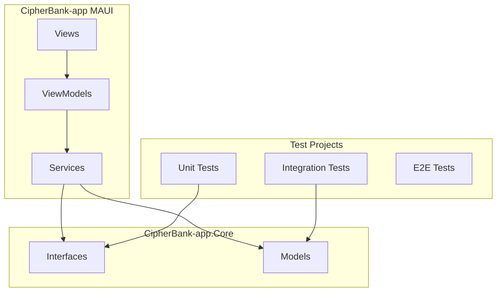
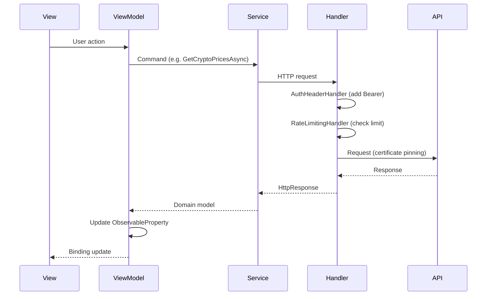

# Architecture

## Overview

CipherBank-app uses a layered architecture with clear separation between the MAUI app, Core library, and test projects.

## Layer Responsibilities

| Layer | Responsibility |
|-------|----------------|
| **Views** | XAML UI, bindings, user interaction. No business logic. |
| **ViewModels** | Presentation logic, commands, state. Uses CommunityToolkit.Mvvm. |
| **Services** | API calls, auth, persistence. Implements Core interfaces. |
| **Core** | Shared interfaces, models, validation, rate limiting. Referenced by tests. |

**Note**: The main app defines its own Models and service interfaces; it does not reference CipherBank-app.Core. The Core library is used by the test projects.

## Data Flow

## HTTP Pipeline

Outgoing HTTP requests pass through the following pipeline (order matters):

1. **PlatformHttpHandlerFactory** – Creates platform-specific handler with certificate pinning (iOS, Android, Windows).
2. **RateLimitingHandler** – Sliding-window rate limiter (60 requests/minute default). Returns 429 if exceeded.
3. **AuthHeaderHandler** – Injects Bearer token from `IAuthService`. Skips auth endpoints (`/auth/login`, `/auth/refresh`, `/auth/register`). Auto-refreshes token if expiring within 5 minutes.
4. **StandardResilienceHandler** – Retry (3 attempts, exponential backoff, jitter), circuit breaker (50% failure, 30s break), timeouts (15s attempt, 60s total).

## Navigation

Shell-based navigation with the following routes:

| Route | Page | Notes |
|-------|------|-------|
| `//LoginPage` | LoginPage | No nav bar, flyout hidden |
| `//MainTabs` | TabBar | Dashboard, Wallets, Buy, Settings |
| `//DashboardPage` | DashboardPage | Market overview |
| `//WalletPage` | WalletPage | Wallet list |
| `//PurchasePage` | PurchasePage | Buy crypto (query: `?symbol=`) |
| `//SettingsPage` | SettingsPage | App settings |
| `//MainPage` | MainPage | Legacy/home |

## Security

### Certificate Pinning

- **iOS/Mac Catalyst**: `IosCertificatePinningHandler` (NSUrlSessionHandler) validates server cert against pinned public key hashes.
- **Android**: `AndroidCertificatePinningHandler` + `NetworkSecurityConfig.xml`.
- **Windows**: `WindowsCertificatePinningHandler` (HttpClientHandler with custom validation).

Pinned hostnames: `api.cipherbank.money`, `api.sandbox.cipherbank.money`. Placeholder pins must be replaced before production.

### Authentication

- Tokens stored via `SecureStorage`.
- `AuthHeaderHandler` adds Bearer token to requests; refreshes when expiring.
- Logout revokes tokens server-side when possible.

### Other

- **Rate limiting**: Client-side sliding window to avoid API abuse.
- **Log redaction**: `LogRedactionHelper` redacts tokens, addresses, wallet IDs, etc.
- **Address validation**: `AddressValidator` for BTC, ETH, SOL formats.

## Mock vs Real Services

`ISettingsService.UseMocks` toggles between mock and real API implementations:

- **DEBUG**: Default `UseMocks = true` (development).
- **Release**: Default `UseMocks = false` (production).

Registered services resolve to `MockAuthService`, `MockCryptoAPIService`, etc. when mocks are enabled.
