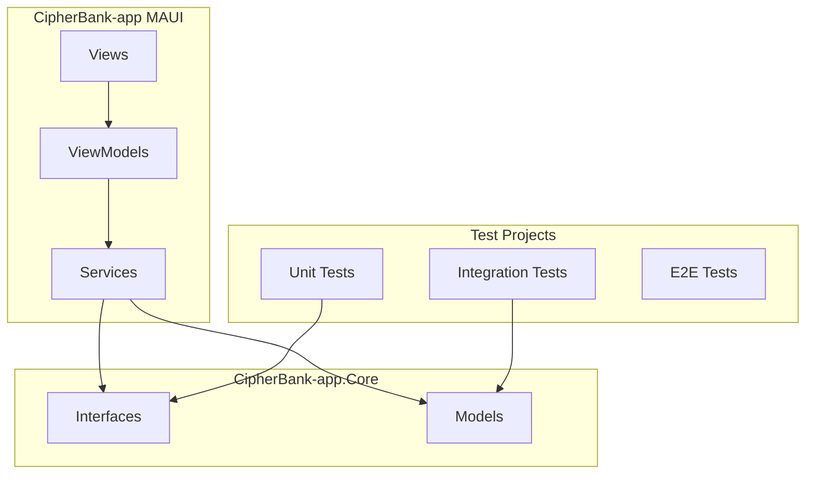
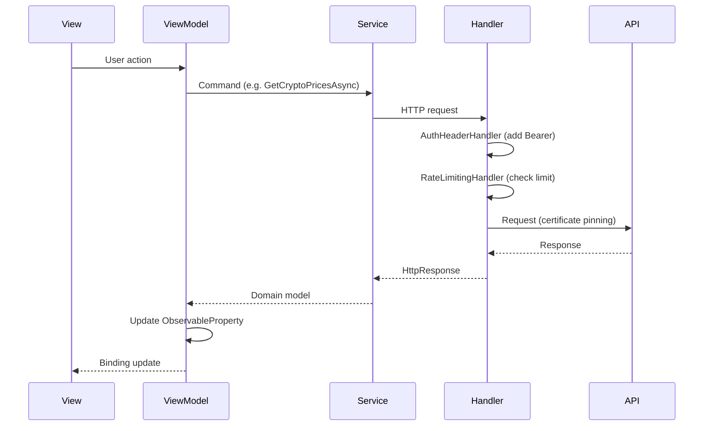

# Architecture

## Overview

CipherBank-app uses a layered architecture with clear separation between the MAUI app, Core library, and test projects.

## Layer Responsibilities

| Layer | Responsibility |
|-------|----------------|
| **Views** | XAML UI, bindings, user interaction. No business logic. |
| **ViewModels** | Presentation logic, commands, state. Uses CommunityToolkit.Mvvm. |
| **Services** | API calls, auth, platform adapters. Implements Core interfaces. |
| **Core** | Domain services, typed configuration, EF Core persistence, dispatch, validation. |

**Note**: The app references CipherBank-app.Core as the single source of truth for Models and service interfaces. Core is MAUI-agnostic.

## Composition and dependency injection

`MauiProgram` is the composition root. It loads the embedded defaults under
`config/`, binds them to typed options, and maps interfaces to production or
development implementations. Core services use constructor injection; dependency
bag records and service-location calls are prohibited by `AGENTS.md` and structure
tests.

The `/v1` abstraction is `IProductClient`: callers model the client they invoke,
not a remote API as a domain object. `InMemoryProductClient` is a stateful
development fixture; behavior-specific unit tests use Moq instead.

## Persistence

Routine data access uses `CipherBankDbContext` and the EF Core SQLite provider.
Repositories do not open connections or embed SQL. Schema changes are EF
`Migrate()`; unmatched prototype SQLite files without `__EFMigrationsHistory`
are wiped. There is no `LocalDbSql` quarantine.

Recipient account and routing values are input-only: repositories convert them to
masks before creating an EF entity, and the EF model has no cleartext properties.

## Dispatch

`SyncJobScheduler` uses the framework `PriorityQueue` for P1/P2 ordering and an
injected `TaskScheduler` for dispatch. A stable sequence number gives FIFO order
within a priority, duplicate keys are rejected while queued or running, and
configuration bounds concurrency to 1–8 workers (`MaxConcurrency` 0 derives half the CPU count).

## Enforced repository structure

- `Directory.Packages.props` is the only NuGet version owner.
- Assembly attributes are generated from project files.
- `scripts/validate-structure.sh` and `RepositoryStructureTests` reject scattered
  SQL, dependency bags, legacy API/mock terminology, and package versions.
- Sonar waits for the server quality gate and no longer excludes interfaces from
  duplicate-code analysis.

## Data Flow

## HTTP Pipeline

Outgoing HTTP requests pass through the following pipeline (order matters):

1. **PlatformHttpHandlerFactory** – Creates platform-specific handler with certificate pinning (iOS, Android, Windows).
2. **RateLimitingHandler** – Sliding-window rate limiter (60 requests/minute default). Returns 429 if exceeded.
3. **AuthHeaderHandler** – Injects Bearer token from `IAuthService`. Skips auth endpoints (`/auth/login`, `/auth/refresh`, `/auth/register`). Auto-refreshes token if expiring within 5 minutes.
4. **StandardResilienceHandler** – Retry (3 attempts, exponential backoff, jitter), circuit breaker (50% failure, 30s break), timeouts (15s attempt, 60s total).

## Navigation

Shell-based navigation via `INavigationService` and `IDialogService` abstractions (implemented with Shell wrappers). ViewModels use these services instead of `Shell.Current` for testability.

Route constants are defined in `Constants/Routes.cs`:

| Constant | Route | Page |
|----------|-------|------|
| Routes.Login | `//LoginPage` | LoginPage |
| Routes.Dashboard | `//DashboardPage` | DashboardPage |
| Routes.Wallet | `//WalletPage` | WalletPage |
| Routes.Purchase | `//PurchasePage` | PurchasePage |
| Routes.PurchaseWithSymbol(symbol) | `//PurchasePage?symbol=BTC` | PurchasePage with pre-selected crypto |
| Routes.Settings | `//SettingsPage` | SettingsPage |

## Security

### Certificate Pinning

- **iOS/Mac Catalyst**: `IosCertificatePinningHandler` (NSUrlSessionHandler) validates server cert against pinned public key hashes.
- **Android**: `AndroidCertificatePinningHandler` + `NetworkSecurityConfig.xml`.
- **Windows**: `WindowsCertificatePinningHandler` (HttpClientHandler with custom validation).

Pinned hostnames: `api.cipherbank.money`, `api.sandbox.cipherbank.money`. Placeholder pins must be replaced before production.

### Authentication

- Tokens stored via `SecureStorage`.
- `AuthHeaderHandler` adds Bearer token to requests; refreshes when expiring.
- Logout revokes tokens server-side when possible.

### Other

- **Rate limiting**: Client-side sliding window to avoid API abuse.
- **Log redaction**: `LogRedactionHelper` redacts tokens, addresses, wallet IDs, etc.
- **Address validation**: `AddressValidator` for BTC, ETH, SOL formats.

## Mock vs Real Services

Mock strategy is **build-time only** (no runtime switching):

- **DEBUG**: Uses mock services (`MockAuthService`, `MockCryptoAPIService`, etc.).
- **Release**: Always uses real services (AuthService, CryptoAPIService, etc.).

`UseMocks` has been removed from settings; registration is conditional via `#if DEBUG` in MauiProgram.
