# M2–M8 package replacement catalog

Research catalog executed 2026-08-17 for the Replace/Defer peel. Keep rows stay BCL/product protocol.

**Date:** 2026-08-17  
**Scope:** live M2–M8 review stack (not the older M1–M4 names in `BUILD_LOG.md`)  
**Package bar:** BCL first, then Microsoft.Extensions, then a widely used NuGet
with a license/maintenance note. No new crypto primitive unless it is
FIPS-specified and portable on Android.

## Finding

The stack already follows the AGENTS rule to prefer framework facilities.
AES-GCM, ChaCha20-Poly1305, PBKDF2, HKDF, `RandomNumberGenerator`, EF Core,
`PriorityQueue`, and `Microsoft.Extensions.Http.Resilience` are in use. Remaining
custom types are mostly product wrappers (packing format, zeroization, suite
composition) or a short list of true rebuilds.

## Verdict summary

| Verdict | Count | Meaning |
| --- | --- | --- |
| Keep | 8 | Already BCL/NuGet, or the custom layer is product protocol |
| Replace | 7 | A first-party or in-tree package can take the algorithm/policy |
| Defer | 2 | A package exists, but platform, wire, or policy blocks it now |

| Function | Layer | Current | Candidate | Verdict |
| --- | --- | --- | --- | --- |
| Persistence | M2 | EF `EnsureCreated` + `LocalDbSql` | EF `Migrate()` | Replace (done) |
| Scheduling | M2 | `PriorityQueue` + `TaskScheduler` | Quartz / Hangfire / Channels | Keep |
| Entropy / RNG | M3/M5/M8 | `RandomNumberGenerator` | Third-party CSPRNG | Keep |
| AES / AEAD / KDF | M3/M5/M8 | BCL `AesGcm`, ChaCha, PBKDF2, HKDF | BouncyCastle AES / new AEAD | Keep wrappers |
| ChallengePass primitives | M5 | BC X25519 + ML-KEM; BCL ChaCha | BCL `MLKem` / `X25519DiffieHellman` | Keep on .NET 10 |
| BIP39 / HD / QR | M3 | NBitcoin, Nethereum.HdWallet, QRCoder | Alternate BIP39/QR libs | Keep |
| Address validation | M3 | unused `AddressValidator` | Deleted; keep `AddressValidate` | Replace (done) |
| HTTP rate limit | M6 | Custom sliding window | `SlidingWindowRateLimiter` | Replace (done) |
| HTTP resilience | M6 | `AddStandardResilienceHandler` | Already Polly | Keep (Shell) |
| Product HTTP duplication | M3/M6 | `HttpProductApi` vs `HttpProductClient` | One `IProductClient` | Replace (done) |
| Legacy REST services | M6 | `AuthService` / wallet / tx REST | Retired onto `IProductClient` | Replace (done) |
| Certificate pinning | M6 | Platform handlers; system CA | TrustKit / pin libraries | Keep |
| Biometrics | M6 | AndroidX Biometric only | `Plugin.Maui.Biometric` 0.0.5 | Replace (done) |
| Charts / Cora motion | M3 | `ChartMath` / `CarouselMath` | LiveCharts2 / Toolkit animations | Keep |
| NFC presentment | M6 | Android NDEF + Null elsewhere | Re-enable pinned Shiny | Defer |
| CommunityToolkit.Maui | M6 | Pinned, commented out | Re-enable when .NET 10 allows | Defer |
| Log redaction | M3 | unused show-ends helper | Deleted (erase/HMAC package is the wrong mask) | Replace (done) |
| Product protocol | M3/M5/M8 | Suites, pack wire, masks, proofs | None | Keep |

## Milestone ownership

Source of truth: [2026-08-11-maui-review-stack-reorg.md](../superpowers/plans/2026-08-11-maui-review-stack-reorg.md).
`BUILD_LOG.md` still uses the old M1–M4 names (Core / ChallengePass / Shell / E2E).

| Layer | Owns |
| --- | --- |
| M2 Persist | EF Core SQLite + `Migrate()`, `SyncJobScheduler` |
| M3 Core | Custody, wallets/QR, charts/Cora, POS payload, V1 client contracts, userdata pack when restacked |
| M4 Harness | Lint/structure scripts and docs (not product behavior) |
| M5 ChallengePass | A1/A2 suites, X25519 + ML-KEM, ChaCha seal (old BUILD_LOG “M2”) |
| M6 Shell | `MauiProgram`, HTTP pipeline, pinning, biometrics, NFC adapter, design system (old “M3”) |
| M7 E2E | Appium story catalog (old “M4”) |
| M8 | Agentic dispatch; userdata/TCP 53809 parked on #34 until M7 lands |

Historical rename: M1a-persist → M2, M1a-core → M3, M1b → M4, ChallengePass → M5, Shell → M6, E2E → M7.

```mermaid
flowchart LR
  subgraph keep [Already packaged]
    EF[EF Core SQLite]
    BCL[AesGcm ChaCha HKDF RNG]
    Res[Http.Resilience]
    NB[NBitcoin QRCoder]
  end
  subgraph wrap [Product wrappers]
    Box[AesGcmCryptoBox packing]
    CP[ChallengePass suite composition]
    Sched[SyncJobScheduler policy]
  end
  subgraph replace [True rebuilds]
    Mig[EF Migrate done]
    RL[SlidingWindowRateLimiter done]
    AV[Unused AddressValidator deleted]
    DupHttp[One IProductClient done]
    Rest[Legacy REST retired]
    Bio[Plugin.Maui.Biometric]
  end
  keep --> wrap
  wrap -.-> replace
```

## Keep

### Scheduling

- **Current:** [`SyncJobScheduler.cs`](../../CipherBank-app.Core/Persist/SyncJobScheduler.cs) — `PriorityQueue` plus injected `TaskScheduler`, key-dedup, P1/P2, concurrency 1–8.
- **Candidates considered:** Quartz.NET, Hangfire, `System.Threading.Channels`, `BackgroundService`.
- **Verdict:** Keep. Quartz/Hangfire are persistent cron hosts, not an in-process sync pump. The scheduler already uses the BCL primitives root `AGENTS.md` requires.

### Entropy / RNG

- **Current:** `RandomNumberGenerator.GetBytes` / `GetInt32` / `Fill` on custody, userdata, ChallengePass, and mocks. There is no custom entropy collector.
- **Special case:** [`RsaOaepSha256UserDataEnrollAlgorithm.cs`](../../CipherBank-app.Core/UserData/RsaOaepSha256UserDataEnrollAlgorithm.cs) uses BouncyCastle `DigestRandomGenerator` so RSA-2048 is deterministic from the mnemonic enroll-seed. That is not OS entropy. BCL `RSA.Create()` cannot do seeded keygen.
- **Verdict:** Keep. Do not introduce a third-party CSPRNG.

### AES / AEAD / KDF wrappers

- **Current algorithms are BCL:** `AesGcm` in [`AesGcmCryptoBox.cs`](../../CipherBank-app.Core/Custody/AesGcmCryptoBox.cs) and userdata ciphers; `ChaCha20Poly1305` in [`PortableChaCha20Poly1305.cs`](../../CipherBank-app.ChallengePass/Crypto/PortableChaCha20Poly1305.cs); `Rfc2898DeriveBytes.Pbkdf2` and `HKDF.DeriveKey`.
- **What is custom:** blob layout (`[version][salt][nonce][tag][cipher]`), zeroization, options validation, suite IDs.
- **Not a replacement:** BouncyCastle AES, `System.Security.Cryptography.Aes` CBC, or a new AEAD package. Changing the AEAD would bump userdata/custody format IDs.
- **Verdict:** Keep the wrappers. The primitive is already the system package. ChallengePass uses ChaCha20-Poly1305 only — no AES in that project.

### ChallengePass primitives (.NET 10)

- **X25519:** [`PortableX25519.cs`](../../CipherBank-app.ChallengePass/Crypto/PortableX25519.cs) via `BouncyCastle.Cryptography` 2.6.2. NSec/libsodium was rejected (Android `libpthread`). BCL `X25519DiffieHellman` ships in **.NET 11**, not 10.
- **ML-KEM-768:** [`MlKem768Provider.cs`](../../CipherBank-app.ChallengePass/Hybrid/MlKem768Provider.cs) via BouncyCastle `FromSeed` (avoids `SecureRandom` clash with NBitcoin’s legacy BC). .NET 10 `System.Security.Cryptography.MLKem` exists but is gated on OpenSSL 3.5 / Windows CNG PQC — Android MAUI is not a safe host yet.
- **AEAD:** ChaCha20-Poly1305 (BCL).
- **Suite composition, fused A2 path, zeroization, HKDF labels, URL-safe wire encoding:** product protocol. No package replaces it.
- **Verdict:** Keep BC + BCL ChaCha. Revisit BCL `MLKem` / `X25519DiffieHellman` only after an `IsSupported` matrix on Android, iOS, and Windows.

### BIP39 / HD / QR

- **Current:** [`MnemonicHelper.cs`](../../CipherBank-app.Core/Custody/MnemonicHelper.cs) wraps NBitcoin; [`AddressDerive.cs`](../../CipherBank-app.Core/Wallets/AddressDerive.cs) uses NBitcoin + Nethereum.HdWallet; [`QrCodeGenerator.cs`](../../CipherBank-app.Core/Wallets/QrCodeGenerator.cs) uses QRCoder 1.6.0.
- **Custom bit:** `MnemonicHelper.Entropy` unpacks word indices because NBitcoin 8 dropped `Mnemonic.Entropy`.
- **Verdict:** Keep. The entropy unpack is a compatibility shim, not a new BIP39 implementation.

### HTTP resilience (Shell) and certificate pinning

- Shell already uses Polly via `AddStandardResilienceHandler` in [`HttpClientExtensions.cs`](../../CipherBank-app/Extensions/HttpClientExtensions.cs) (retry, circuit breaker, timeouts).
- Core [`HttpProductClient.cs`](../../CipherBank-app.Core/V1/HttpProductClient.cs) does **not** use that pipeline. It has a one-shot 401 → refresh session → retry. That is product session policy, not a missing Polly package. Do not swap it for generic HTTP retry without preserving the refresh contract.
- Pinning uses platform APIs (`NetworkSecurityConfig.xml`, `NSUrlSessionHandler`, Windows custom validation). Android pin-sets are currently **system CA only** until ops publishes real SPKIs (M6+). No mature cross-platform MAUI pinning package; TrustKit is iOS-only.
- **Verdict:** Keep. Production pins are an ops item, not a library gap.

### Charts and Cora motion

- [`ChartMath.cs`](../../CipherBank-app.Core/Charts/ChartMath.cs) is a small SVG path port from Cora. LiveCharts2 (`LiveChartsCore.SkiaSharpView.Maui`, still RC) is a full Skia chart stack, not a path-math swap.
- [`CarouselMath.cs`](../../CipherBank-app.Core/Animations/CarouselMath.cs) / `SpringState` are Cora snap-spring constants. CommunityToolkit animations would change the feel.
- **Verdict:** Keep.

### Product protocol

ChallengePass A1/A2 composition, userdata pack/enroll wire, `IProductClient` DTOs, recipient mask policy, session proof builder, and Cora lines are CipherBank behavior. Packages can supply primitives underneath; they cannot own the protocol.

- **Verdict:** Keep.

## Replace

### Persistence (EF Migrate)

- **Was:** `EnsureCreated` plus a `LocalDbSql` compatibility script for pre-EF recipient wreckage. Those SQLite files were lab leftovers, not a shipped-user constraint.
- **Replacement:** `Database.MigrateAsync` from an `InitialCreate` migration matching `CipherBankDbContext`. Prototype files without `__EFMigrationsHistory` are deleted.
- **Not a replacement:** sqlite-net-pcl or Dapper — they would rewrite repositories and add more SQL, against the persist contract.
- **Verdict:** Replace (done). Recipient mask policy stays in repositories.

### Unused address validator

- **Was:** hand-rolled Base58/Bech32/ETH/SOL regex with no production callers.
- **Kept:** [`AddressValidate.cs`](../../CipherBank-app.Core/Wallets/AddressValidate.cs) — NBitcoin for BTC/LTC/DOGE, regex for ETH, alphabet-only XMR. Used by `AddWalletViewModel`.
- **Not added:** Nethereum EIP-55 or an invented XMR decoder.
- **Verdict:** Replace (done).

### HTTP rate limit

- **Was:** custom sliding window plus `RateLimitingHandler` (wait up to 30s, else 429).
- **Replacement:** shared `SlidingWindowRateLimiter` (60/min, `QueueLimit = 0` fail-fast) in the `AddStandardResilienceHandler` rate-limiter slot. Pipeline is pin → auth → resilience.
- **Verdict:** Replace (done).

### Duplicate product HTTP clients

- **Was:** Shell `HttpProductApi` plus a second Core typed `HttpClient` without pinning/rate-limit/resilience.
- **Replacement:** Shell `AddCipherBankHttpClient<HttpProductClient>()`; Core no longer registers `IProductClient`. 401 refresh stays on `HttpProductClient`.
- **Verdict:** Replace (done).

### Legacy REST services

- **Was:** Shell `AuthService`, `WalletService`, `TransactionService`, and `CryptoAPIService` plus DEBUG mocks beside `IProductClient`.
- **Replacement:** Login, dashboard, wallet, purchase, and settings ViewModels call `IProductClient` / `IPublicQuoteService` / `IProductSessionStore`. `AuthHeaderHandler` injects the product session only.
- **Verdict:** Replace (done). Not a third-party package.

### Biometrics

- **Was:** AndroidX `BiometricPrompt` only; iOS and Windows returned unavailable.
- **Replacement:** [`BiometricService.cs`](../../CipherBank-app/Services/BiometricService.cs) via `Plugin.Maui.Biometric` 0.0.5 (`IBiometric` injected from `BiometricAuthenticationService.Default`). Logical gate only — the custody key stays in SecureStorage. 0.1.1 does not restore against MAUI 10.0.0 AndroidX.
- **Verdict:** Replace (done).

## Defer

### NFC presentment

- Payload is product JSON (`tokenRef` only). Android presentment stays in [`AndroidNdefPresentmentService.cs`](../../CipherBank-app/Platforms/Android/Nfc/AndroidNdefPresentmentService.cs); other platforms use `NullNfcPresentmentService`.
- 2026-08-17 spike: `Shiny.Hosting.Maui` 3.3.4 is host-only; Shiny.Nfc was not carried into v3. Do not add `Plugin.Maui.NFC`.
- **Verdict:** Defer. Keep the Android NDEF adapter behind `INfcPresentmentService`.

### Disabled-but-pinned CommunityToolkit.Maui

- `CommunityToolkit.Maui` 12.2.0 and `CommunityToolkit.Maui.Markup` 6.0.1 remain version-pinned; `ShellDialogService` stays the testable wrapper.
- 2026-08-17 spike: restore failed NU1608 — Toolkit 12.2.0 requires `Microsoft.Maui.Controls >= 9.0.90 && < 10.0.0`.
- **Verdict:** Defer. Re-enable when a net10.0 Toolkit ships. Do not shop for a substitute popup package.

## Do not replace

Later reviews should not re-open these without a threat-model or platform-matrix change:

1. Always Encrypted, sqlite-net-pcl, or Dapper as a persist rewrite (EF `Migrate()` is the schema lifecycle).
2. BCL `AesGcm` / `ChaCha20Poly1305` / PBKDF2 / HKDF engines (wrappers stay for packing and zeroization).
3. `RandomNumberGenerator` as the OS CSPRNG.
4. ChallengePass A1/A2 suite composition, fused identity path, HKDF domain labels, or wire IDs.
5. BouncyCastle X25519 / ML-KEM-768 on .NET 10 Android until `IsSupported` is proven on device.
6. Deterministic BouncyCastle RSA enroll (BCL cannot seed RSA keygen).
7. NBitcoin BIP39 / HD derive; QRCoder QR matrix generation.
8. `SyncJobScheduler` policy (key-dedup, P1/P2, bounded concurrency) — already BCL `PriorityQueue` + `TaskScheduler`.
9. Inventing a Monero address checksum instead of a real decoder.
10. Inventing production SPKI pin hashes.

## Later implementation order

Remaining after this pass:

1. Re-enable pinned `CommunityToolkit.Maui` when a release accepts `Microsoft.Maui.Controls` 10.x; keep `ShellDialogService`.
2. NFC stays on Android NDEF until a net10 host API exists. Do not add `Plugin.Maui.NFC`.

## Related

- Root contract: [`AGENTS.md`](../../AGENTS.md)
- Persist contract: [`CipherBank-app.Core/Persist/AGENTS.md`](../../CipherBank-app.Core/Persist/AGENTS.md)
- ChallengePass contract: [`CipherBank-app.ChallengePass/AGENTS.md`](../../CipherBank-app.ChallengePass/AGENTS.md)
- Staged work: [`STACK_STAGED_WORK.md`](../STACK_STAGED_WORK.md)
- Userdata pack design: [`USER_DATA_ENCRYPTION.md`](../USER_DATA_ENCRYPTION.md)
- Central package versions: [`Directory.Packages.props`](../../Directory.Packages.props)
