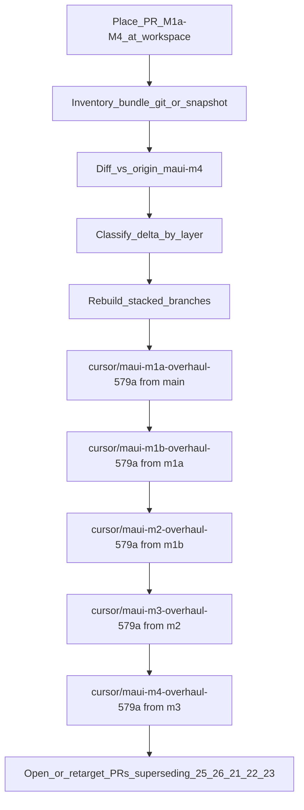

# M1a–M4 overhaul comparison

**Date:** 2026-08-10  
**Agent:** https://cursor.com/agents/bc-1e6bfc45-63b7-4bdf-a73f-3b69fef8579a  
**Workspace base:** `prototype/maui-m1a` @ `a424890`

## Verdict (current)

**Local overhaul tree was not available in this cloud VM**, so a file-level diff of `~/Desktop/CipherBank/App_BuildSpace/PR_M1a-M4` vs the GitHub stack could not be run.

Exhaustive search + 40s poll found no `PR_M1a-M4` / `App_BuildSpace` under `/workspace`, `/home/ubuntu`, `/opt/cursor`, or `/tmp`. XFCE Desktop has no `Desktop/` folder. Cloud agents only receive the git repo (`github.com/cb-st/cipherbank-app`), not sibling Desktop folders from the launching machine.

**What follows is the complete inventory of the existing stacked PRs**, plus a concrete adoption plan to run the moment the bundle is placed at `/workspace/PR_M1a-M4`.

---

## Existing stack inventory

Formal review stack (linked on #25 as stack #30):

| Layer | PR | Base ← Head | Tip SHA | Layer delta | Status notes |
|-------|----|-------------|---------|-------------|--------------|
| **M1a** | [#25](https://github.com/CB-st/CipherBank-App/pull/25) | `main` ← `prototype/maui-m1a` | `a424890` | 171 files, +9998/−242 (15 commits) | OPEN; Sonar QG passed; many unresolved human threads (ConnorS-P) |
| **M1b** | [#26](https://github.com/CB-st/CipherBank-App/pull/26) | `m1a` ← `m1b` | `ccdcf7f` | 30 files, +2545/−286 (7 commits) | OPEN; **CHANGES_REQUESTED** (harness/docs contract) |
| **M2** | [#21](https://github.com/CB-st/CipherBank-App/pull/21) | `m1b` ← `m2` | `14a4c11` | 47 files, +2876/−2 (21 commits) | OPEN; no open review threads sampled |
| **M3** | [#22](https://github.com/CB-st/CipherBank-App/pull/22) | `m2` ← `m3` | `9aee1a3` | 118 files, +7955/−334 (8 commits) | OPEN; open threads on `ReceiveViewModel` |
| **M4** | [#23](https://github.com/CB-st/CipherBank-App/pull/23) | `m3` ← `m4` | `171ffb1` | 76 files, +5004/−322 (35 commits) | OPEN; open threads (idle-lock PQ, gitignore, HomeViewModel, spent plans) |

**Ancestry:** strict linear stack `main ⊂ m1a ⊂ m1b ⊂ m2 ⊂ m3 ⊂ m4`.

**Full tip vs main:** `origin/prototype/maui-m4` ≈ 421 files, +28155/−963.

### Layer contents

```
main
 └─ M1a Core + unit tests (Custody, Session, Persist, V1, Wallets, Pos, Charts, Cora)
     └─ M1b docs/lint (AGENTS, BUILD_LOG, scripts/lint*, Sonar/e2e skeleton)
         └─ M2 CipherBank-app.ChallengePass (+ tests)
             └─ M3 Cora MAUI Shell (Views/VMs/Services, MauiProgram wiring)
                 └─ M4 Appium E2E account wave + BUILD_LOG
```

### Related divergent branch: `prototype/maui-m5`

- Tip `099c5d8` (2026-08-02) — **not** an ancestor of `maui-m4` (Aug 7 tip), and vice versa.
- Unique wins vs current stacked tip include **NuGet Central Package Management** (`Directory.Packages.props`), Release build fixes, WireMock/integration compile fixes, multi-platform package conditioning.
- Human review on #25 explicitly asked for CPM (`Should be using central package management`) — that ask is **satisfied on m5, not on m4**.

Any local overhaul that “more completely” fixes the PRs should be checked against both the stacked tip **and** these m5 build/CPM improvements.

---

## Open review pressure (what an overhaul should beat)

### #25 M1a — unresolved human themes (sample)

- Sonar workflow: coverage gating, artifact download vs `needs:`, interface exclusions, comment removals
- Prefer **central package management**
- Style/API nits: ChartMath epsilon behavior, docs on parameters, `var`, AssemblyInfo in csproj
- Persist: EF Core / PriorityQueue / TaskScheduler suggestions; Moq for mocks
- Copyright / license gaps

Codex P1/P2 on custody reseal staged-secret, unlock rollback, stream serialize, PBKDF off UI thread — author marked fixed in `da56554` (verify still on tip).

### #26 M1b — CHANGES_REQUESTED

- `parse_args` still allows trailing junk after `--all` (typo → expensive emulator run)
- README / BUILD_LOG “quick verify” points at account wave that is M4-only (contract lie on M1b)

### #22 M3 — open

- `ReceiveViewModel.LoadAsync` must clear prior receive state before resolve
- `DeriveNewAsync` must retain newly derived address/path

### #23 M4 — open

- Idle-lock PQ clear must not block UI thread (`AppIdleLockService`)
- Broader `.gitignore` for local env files
- `HomeViewModel` portfolio/chart exception handling
- Remove agent-directed spent plans under `docs/superpowers/plans/`

---

## Local bundle inventory

| Check | Result |
|-------|--------|
| Path `/workspace/PR_M1a-M4` | **Missing** |
| Path `~/Desktop/CipherBank/App_BuildSpace/PR_M1a-M4` | **Missing** (no Desktop mount) |
| Nested `.git` / docs / structure | **N/A** |
| Diff vs `origin/prototype/maui-m4` | **Blocked** |

**Unblock:** place the folder at `/workspace/PR_M1a-M4` (drag/drop into the cloud workspace, or `scp`/attach), then re-run this agent or say “bundle is ready”.

---

## Adoption plan (execute after upload)

Default decision (no optionality): **treat the local tree as a candidate full-stack replacement**, then re-slice onto the same review bases so AI review stays under the ~10k churn cap.



### Steps

1. **Inventory** `/workspace/PR_M1a-M4`
   - If it has `.git`, note tip SHA and whether it tracks CB-st remotes.
   - If it is a bare snapshot, treat as working tree vs `origin/main`.

2. **Diff**
   - `diff -rq` / `git diff --no-index` against a worktree of `origin/prototype/maui-m4`.
   - Also spot-check `Directory.Packages.props` and Release/iOS packaging vs `origin/prototype/maui-m5`.
   - Partition file deltas into M1a / M1b / M2 / M3 / M4 ownership using the same boundaries as today’s stack.

3. **Land strategy (chosen default)**
   - Do **not** force-push over `prototype/maui-m*` until the new stack builds and Sonar-clears.
   - Create parallel stacked branches `cursor/maui-m{1a,1b,2,3,4}-overhaul-579a`.
   - Open new PRs (or update existing PR heads if the team prefers reuse) with bases matching today’s stack.
   - Mark #25/#26/#21/#22/#23 superseded in descriptions once the new stack is green.
   - Fold m5 CPM / Release fixes into the earliest owning layer (likely M1a/M1b) if the local tree omitted them but still needs them for Connor’s threads.

4. **Verify per layer**
   - M1a: `dotnet test CipherBank-app.Tests` + Coverlet/Sonar under +10k churn
   - M1b: `./scripts/lint.sh csharp shell`; fix parse_args + quick-verify contract
   - M2: build ChallengePass + tests
   - M3: `dotnet build` Android head; ReceiveViewModel clears
   - M4: build E2E; idle-lock / HomeViewModel / gitignore / spent-plan cleanup

5. **Close the loop**
   - Update `docs/BUILD_LOG.md` map to the new branch names.
   - Keep Expo / `design_handoff_cipherbank/` out of the merge path.

---

## Immediate ask

Upload or copy the Desktop bundle into this agent as:

```text
/workspace/PR_M1a-M4
```

Then request a follow-up pass to run steps 1–3 and produce the real side-by-side file verdict.
