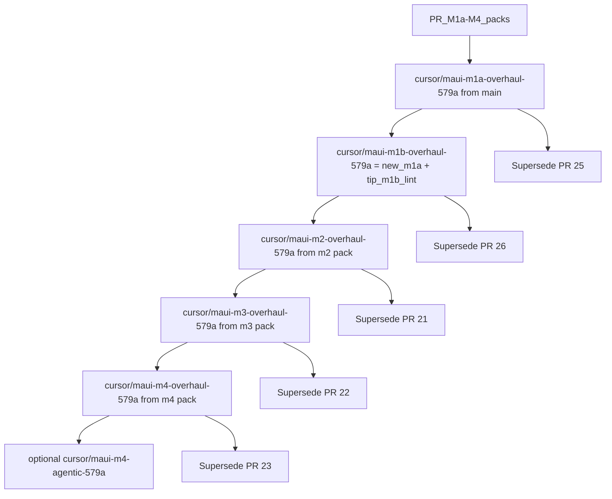

# Compare local PR_M1a-M4 overhaul vs existing stack

**Bundle:** `/home/skyrailmaxima/Desktop/CipherBank/App_BuildSpace/PR_M1a-M4`  
**Existing tips:** `origin/prototype/maui-m{1a,1b,2,3,4}` @ `a424890` / `ccdcf7f` / `14a4c11` / `9aee1a3` / `171ffb1`  
**Compared:** 2026-08-09 (local)

## Verdict

**Replace the open stacked PR tips with the review-addressed packs**, rebuilt as a parallel review stack, then supersede #25/#26/#21/#22/#23.

The packs are a **Core/architecture overhaul** (CPM, EF persist, typed config, DI renames) that also carries m2–m4 tip security outcomes. They are **not** a small selective merge onto today’s heads.

| Question | Answer |
| --- | --- |
| Improves vs `#25`–`#23` tips? | **Yes** — architecture + Connor M1a themes + design-system/templates; security wipe/idle-lock/mnemonic already on tips are preserved |
| Fold m1b? | **No** — m1a pack has 1 of 23 m1b-only files (`AGENTS.md` only); lint harness must be rebased separately |
| Best product tip | `maui-m4-review-addressed` |
| Optional fifth slice | `prototype-agentic-foundation` (+18 files, no product behavior) |

---

## 1. Bundle inventory

| Pack | Inner root | Files | `.git` | CPM | ChallengePass | E2E Stories | Review map |
| --- | --- | --- | ---: | --- | --- | --- | --- |
| m1a-review-addressed | `…/CipherBank-App-prototype-maui-m1a` | 375 | no | yes | no | no | `docs/review/m1a-comment-resolution.md` |
| m2-review-addressed | `…/maui-m2` | 460 | no | yes | yes | no | `m2-alignment-resolution.md` (+ m1a map) |
| m3-review-addressed | `…/maui-m3` | 557 | no | yes | yes | no | `m3-alignment-resolution.md` |
| m4-review-addressed | `…/maui-m4` | 615 | no | yes | yes | yes | `m4-alignment-resolution.md` |
| agentic-foundation | `…/maui-m4` | 633 | no | yes | yes | yes | `m4-agentic-foundation.md` + `docs/agentic/*` |

Zip counterparts exist for m1a–m4 (not agentic). Packs are **snapshots** — apply via source sync onto git branches.

Corresponding tip file counts (no CPM on any tip): m1a 333 · m1b 355 · m2 400 · m3 486 · m4 537.

---

## 2. Diff vs stack tips (exclude bin/obj/.git)

| Pair | only on tip | only in pack | content differ |
| --- | ---: | ---: | ---: |
| m1a pack vs `maui-m1a` | 9 | 51 | 44 |
| m2 pack vs `maui-m2` | 9 | 69 | 61 |
| m3 pack vs `maui-m3` | 10 | 81 | 98 |
| m4 pack vs `maui-m4` | 10 | 88 | 140 |
| agentic vs m4 pack | 0 | 18 | 7 |

### Markers (m1a/m4 pattern)

| Path | Tip | Pack |
| --- | --- | --- |
| `Directory.Packages.props` | absent | present |
| `Persist/CipherBankDbContext.cs`, `Persist/Sql/LocalDbSql.cs` | absent | present |
| `Custody/ICryptoBox.cs`, `Session/ProductSessionCoordinator.cs` | absent | present |
| `V1/IProductClient.cs` | absent | present |
| `Session/AppSessionDeps.cs`, `V1/IProductApi.cs`, `MockProductApi.cs` | present | removed |
| `docs/review/m1a-comment-resolution.md` | absent | present |
| `scripts/lint.sh` / `docs/BUILD_LOG.md` | m1b+ / m2+ tips | present from m2 pack up |
| `config/agentic/dispatch.json` | absent | agentic only |

### m1b fold check

23 files exist on `maui-m1b` but not `maui-m1a`. **Only `AGENTS.md` appears in the m1a pack.** Missing from pack: `scripts/lint*`, `docs/{BUILD_LOG,SONAR_*,LOCAL_*,MAUI_FUNCTION_REF}.md`, e2e harness scripts, etc.

### Area hotspots (m4 pack vs tip)

- **Pack adds:** `templates/`, `config/`, Core `Configuration/`, EF persist, custody/session DI, ChallengePass options, E2E AGENTS/DeviceProfile
- **Tip-only leftovers retired:** `AppSessionDeps`, `IProductApi`/`MockProductApi`, `CoraLines`, Core `AssemblyInfo.cs`, mock quote service + Mock* tests
- **Content diffs:** Shell Views/VMs/Controls, Core Persist/Custody, E2E PageObjects/Support/Stories, docs, tooling props

---

## 3. Deltas by area

| Area | Delta |
| --- | --- |
| **Core** | Injectable crypto; EF SQLite + `LocalDbSql`; `IProductClient`; session coordinator; typed options; PriorityQueue dispatch |
| **ChallengePass** | Tip wipe semantics preserved; pack adds options/DI module registration |
| **Shell (M3+)** | Design-system/theme wiring; Receive/ViewModels rebind to `IProductClient`; mnemonic/idle-lock tip fixes preserved |
| **E2E (M4)** | Tip account-wave kept; pack adds structure contracts, templates, stricter env allowlist |
| **Docs/tooling** | Resolution maps; templates; `validate-structure.sh`; subtree AGENTS |
| **CI** | Broader same-repo Sonar/coverage; QG wait; CPM; drop interface CPD exclusions |
| **m1b lint** | Still owned by tip `#26` — must rebase onto new m1a |

---

## 4. Adoption judgment

**Chosen approach: rebuild as a new parallel stack that replaces the open PR heads.**

Not selective merge (architecture rename/`IProductApi`→`IProductClient` + EF is too invasive).  
Not silent force-push of current `prototype/maui-m*` until builds/Sonar clear on the new branches.

---

## 5. Concrete landing plan

### Branches (parallel; then retarget or replace heads)

| Layer | Branch | Source tree | Base |
| --- | --- | --- | --- |
| M1a | `cursor/maui-m1a-overhaul-579a` | m1a-review-addressed pack | `main` |
| M1b | `cursor/maui-m1b-overhaul-579a` | new m1a + **copy m1b-only lint/docs from `origin/prototype/maui-m1b`** | new m1a |
| M2 | `cursor/maui-m2-overhaul-579a` | m2-review-addressed pack | new m1b |
| M3 | `cursor/maui-m3-overhaul-579a` | m3-review-addressed pack | new m2 |
| M4 | `cursor/maui-m4-overhaul-579a` | m4-review-addressed pack | new m3 |
| Optional | `cursor/maui-m4-agentic-579a` | agentic-foundation pack | new m4 |

### Apply method per pack

1. `git checkout -b <branch> <base>`
2. Rsync pack inner root → repo (exclude `bin`/`obj`/`.git`)
3. Commit: `feat(<layer>): apply PR_M1a-M4 review-addressed overhaul`
4. For m1b: cherry-pick / copy the 22 missing lint+docs paths from tip `maui-m1b`, resolve overlaps with pack `AGENTS.md`
5. Verify gates before opening/updating PRs

### Verify

- M1a: `dotnet test CipherBank-app.Tests`; Coverlet + Sonar; keep review churn discipline
- M1b: `./scripts/lint.sh csharp shell`; fix tip CHANGES_REQUESTED (`parse_args` trailing junk; quick-verify honesty)
- M2: ChallengePass build + tests
- M3: Android MAUI build; ReceiveViewModel clear-before-load still held
- M4: E2E project build; idle-lock / gitignore / spent-plan tip issues re-check
- Agentic: `scripts/validate-structure.sh` + `AgenticDispatchTests`

### Supersede open PRs

Update descriptions (or open replacement PRs) for:

1. [#25](https://github.com/CB-st/CipherBank-App/pull/25) ← m1a overhaul  
2. [#26](https://github.com/CB-st/CipherBank-App/pull/26) ← m1b lint on new m1a  
3. [#21](https://github.com/CB-st/CipherBank-App/pull/21) ← m2 pack  
4. [#22](https://github.com/CB-st/CipherBank-App/pull/22) ← m3 pack  
5. [#23](https://github.com/CB-st/CipherBank-App/pull/23) ← m4 pack  

Point each at its `docs/review/*resolution.md`. Keep Expo / design handoff out of path. License still owner follow-up.

### Out of scope for this landing

- Declaring MIT/BSD (explicitly deferred in m1a resolution doc)
- Force-pushing `prototype/maui-m*` before green CI
- Merging agentic without the m4 product baseline
