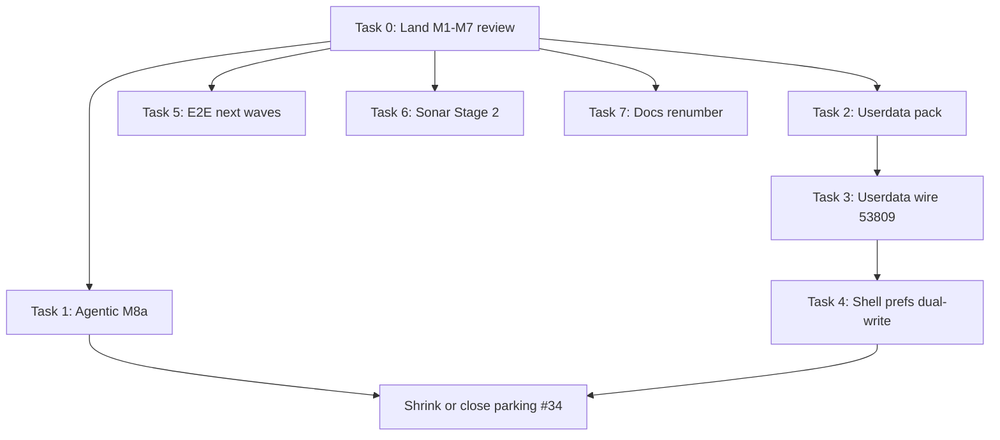

# M8 next application to-dos

> **For agentic workers:** REQUIRED SUB-SKILL: Use `superpowers:subagent-driven-development` (recommended) or `superpowers:executing-plans` when executing a **single** phase below. Do not run all phases in one PR.

**Goal:** Ordered post–M1–M7 work: finish the review gate, land parked M8 slices (agentic → userdata → prefs), then expand product E2E and Sonar Stage 2 without re-breaking the stack.

**Architecture:** Keep earliest-owning-layer discipline (`AGENTS.md`). Feature work parks on `prototype/maui-m8-draft` ([#34](https://github.com/CB-st/CipherBank-App/pull/34)) until a phase is ready to peel into its own PR onto `maui-m7` (or onto the landed main tip once M7 merges).

**Tech stack:** .NET 10 MAUI, Core + ChallengePass, Appium E2E, CPM / StyleCop / Sonar, userdata wire on TCP **53809**.

## Global constraints

- Day-to-day: root `AGENTS.md`, `docs/BUILD_LOG.md`, `docs/SONAR_GATE.md`.
- Stack map: `docs/superpowers/plans/2026-08-11-maui-review-stack-reorg.md`.
- Parking inventory: `docs/reviews/M8_PARKING_LOT.md`.
- Every Core/ChallengePass public surface change: `dotnet test CipherBank-app.Tests` **and** `dotnet build CipherBank-app/CipherBank-app.csproj -f net10.0-android`.
- E2E failures under `E2E_RUN=1` must fail + write `docs/tests/gaps/` (no soft-pass).
- No Expo / `design_handoff_cipherbank/` on MAUI PRs.
- Force-with-lease only with explicit approval.
- Prefer peel-thin PRs off M8 over growing #34 into another mega-diff.

---

## Current stack (do not renumber casually)

| Layer | PR | Branch | Role |
|-------|-----|--------|------|
| M1 | [#33](https://github.com/CB-st/CipherBank-App/pull/33) | `prototype/maui-m1a-platform` | Platform / CPM / Sonar |
| M2 | [#35](https://github.com/CB-st/CipherBank-App/pull/35) | `prototype/maui-m2-persist` | EF Persist |
| M3 | [#36](https://github.com/CB-st/CipherBank-App/pull/36) | `prototype/maui-m3-core` | Core remainder |
| M4 | [#37](https://github.com/CB-st/CipherBank-App/pull/37) | `prototype/maui-m4-harness` | Harness + docs |
| M5 | [#38](https://github.com/CB-st/CipherBank-App/pull/38) | `prototype/maui-m5` | ChallengePass |
| M6 | [#39](https://github.com/CB-st/CipherBank-App/pull/39) | `prototype/maui-m6` | Shell |
| M7 | [#40](https://github.com/CB-st/CipherBank-App/pull/40) | `prototype/maui-m7` | E2E |
| M8 draft | [#34](https://github.com/CB-st/CipherBank-App/pull/34) | `prototype/maui-m8-draft` | Parking (agentic + review docs; userdata later) |

Legacy open heads (#20–#26, #25, #32) are superseded labels only — close or leave draft after M1–M7 merge; do not restack product onto them.

---

## File / ownership map (next wave)

| Concern | Primary paths | Owner layer |
|---------|---------------|-------------|
| Agentic dispatch | `config/agentic/`, `templates/**`, `scripts/create-dispatch.py`, `docs/agentic/*`, `CipherBank-app.Tests/Architecture/AgenticDispatchTests.cs` | M8 → can land first thin PR on M7 |
| Userdata pack crypto | `CipherBank-app.Core/UserData/*` (pack/KDF/AES-GCM/RSA enroll) from [#28](https://github.com/CB-st/CipherBank-App/pull/28) | Core (M3 tip or post-merge main) |
| Userdata wire / 53809 | `UserDataClient`, `TcpUserDataTransport`, `UserDataLoopbackServer`, prefs sync stubs from [#29](https://github.com/CB-st/CipherBank-App/pull/29) | Core, then Shell DI |
| Prefs dual-write | Shell unlock / `IProductClient` prefs + `UserDataPrefsSyncService` | Shell (M6+) after client lands |
| E2E next waves | `CipherBank-app.E2ETests/Stories/*`, `PageObjects/*`, `docs/tests/gaps/` | M7 / follow-on |
| Sonar Stage 2 | SA1402/SA1649 per `docs/SONAR_STRUCTURAL_PLAN.md` | Earliest owning file’s layer |
| Docs truth | `docs/BUILD_LOG.md` still describes old M1–M4 names | M4 harness or M8 docs PR |

---

### Task 0: Finish M1–M7 review gate (blocking)

**Files:** PR descriptions only; no product code unless bot/Sonar residuals.

**Produces:** Mergeable stack accepted bottom-up (M1 → … → M7).

- [ ] **Step 1:** Confirm each stacked PR base is correct (#33→main, #35→m1a-platform, #36→m2-persist, #37→m3-core, #38→m4-harness, #39→m5, #40→m6).
- [ ] **Step 2:** Clear Sonar / bot `new_violations` on each tip before inviting the next review (`docs/SONAR_GATE.md`).
- [ ] **Step 3:** On M3+ tips that touch Core public surface, run:

```bash
export PATH="$HOME/.local/dotnet:$PATH"
source scripts/lib/android-env.sh
dotnet test CipherBank-app.Tests/CipherBank-app.Tests.csproj -c Release
dotnet build CipherBank-app/CipherBank-app.csproj -f net10.0-android
```

- [ ] **Step 4:** On M7 tip, confirm E2E project builds (`dotnet build CipherBank-app.E2ETests`) and account wave remains the proven baseline (`docs/tests/STORY_ID_MAP.md`).
- [ ] **Step 5:** Execute **Task 0b** (draft + mark redundant legacy PRs) before merging the new stack.
- [ ] **Step 6:** Inventory legacy review comments + Sonar residuals; fix on the **earliest owning new tip** (M1–M7), not on legacy heads.

**Done when:** Reviewers treat #33–#40 as the only active MAUI stack; #34 stays draft; legacy heads are draft and labeled redundant where applicable.

---

### Task 0b: Draft legacy PRs and mark redundancy

**Produces:** All superseded stack PRs are **draft**; each has a comment mapping to the replacement PR; userdata drafts stay open (not redundant).

| Legacy PR | Action | Replacement / note |
|-----------|--------|--------------------|
| [#20](https://github.com/CB-st/CipherBank-App/pull/20) | Keep draft; mark redundant | [#33](https://github.com/CB-st/CipherBank-App/pull/33) M1 |
| [#21](https://github.com/CB-st/CipherBank-App/pull/21) | Convert draft; mark redundant | [#38](https://github.com/CB-st/CipherBank-App/pull/38) M5 |
| [#22](https://github.com/CB-st/CipherBank-App/pull/22) | Convert draft; mark redundant | [#39](https://github.com/CB-st/CipherBank-App/pull/39) M6 |
| [#23](https://github.com/CB-st/CipherBank-App/pull/23) | Convert draft; mark redundant | [#40](https://github.com/CB-st/CipherBank-App/pull/40) M7 |
| [#24](https://github.com/CB-st/CipherBank-App/pull/24) | Keep draft; mark redundant | Whole-stack-into-main — use #33–#40 |
| [#25](https://github.com/CB-st/CipherBank-App/pull/25) | Convert draft; mark redundant | Split → [#33](https://github.com/CB-st/CipherBank-App/pull/33)/[#35](https://github.com/CB-st/CipherBank-App/pull/35)/[#36](https://github.com/CB-st/CipherBank-App/pull/36) |
| [#26](https://github.com/CB-st/CipherBank-App/pull/26) | Convert draft; mark redundant | [#37](https://github.com/CB-st/CipherBank-App/pull/37) M4 |
| [#28](https://github.com/CB-st/CipherBank-App/pull/28)/[#29](https://github.com/CB-st/CipherBank-App/pull/29) | Keep draft; **not redundant** | Fold onto M8 after Core restack (Task 2–3) |
| [#31](https://github.com/CB-st/CipherBank-App/pull/31) | Keep draft; mark redundant | Docs folded into [#34](https://github.com/CB-st/CipherBank-App/pull/34) |
| [#32](https://github.com/CB-st/CipherBank-App/pull/32) | Keep draft; mark redundant | [#34](https://github.com/CB-st/CipherBank-App/pull/34) |

- [ ] **Step 1:** `gh pr convert to draft` for every non-draft row above marked redundant.
- [ ] **Step 2:** Post one PR comment per legacy head with the replacement link and “do not merge / do not restack product here”.
- [ ] **Step 3:** Prefix titles with `DRAFT redundant:` where not already clear (REST PATCH).
- [ ] **Step 4:** Harvest review + issue comments from #21/#22/#23/#25/#26/#20 into `docs/reviews/LEGACY_COMMENT_TRIAGE.md` on M8 (or M4 docs tip); map each actionable item → new M{N} owner.

**Done when:** Only #33–#40 (plus #34 parking and #28/#29 userdata) are non-redundant open work; legacy stack is all draft.

---

### Task 0c: Address legacy comments + Sonar on M1–M7

**Consumes:** Triage file from Task 0b Step 4; Sonar `issues.json` / PR checks on #33–#40.

**Produces:** Fixes committed on the earliest owning new branch, then merged/rebased upward.

- [ ] **Step 1:** Export open review threads + bot findings from legacy PRs; classify Fix / Already-done / Won’t-fix (with reason).
- [ ] **Step 2:** For each Fix, land on earliest owner (`maui-m1a-platform` … `maui-m7`); Shell build when Core surface moves.
- [ ] **Step 3:** Pull Sonar new_violations on each new PR; clear HIGH/CRITICAL before inviting review (`docs/SONAR_GATE.md`).
- [ ] **Step 4:** Cross-PR duplication comments only where a later tip re-touches an earlier fix site (`AGENTS.md`).
- [ ] **Step 5:** Re-verify unit tests on touched tips; Android build from M3/M6 upward as needed.

**Done when:** Triage file shows no open Fix rows without a commit SHA on the new stack; Sonar gate soft-pass only per documented MEDIUM/LOW policy.

---

### Task 1: Peel / land agentic foundation from M8

**Files (already on #34 tip):**
- `config/agentic/dispatch.json`, `config/agentic/README.md`
- `templates/dispatch|feature|resource/**`
- `scripts/create-dispatch.py`, `scripts/validate-structure.sh` (agentic sections)
- `docs/agentic/*`, `docs/review/m4-agentic-foundation.md`
- `CipherBank-app.Tests/Architecture/AgenticDispatchTests.cs`
- Root / subtree `AGENTS.md` / README pointers

**Consumes:** M7 tip as base.  
**Produces:** Optional thin PR `M8a: agentic foundation` (or merge #34 docs+agentic only once M7 is accepted).

- [ ] **Step 1:** On `prototype/maui-m8-draft`, run structure + unit gates:

```bash
bash scripts/validate-structure.sh
python3 -m py_compile scripts/create-dispatch.py
dotnet test CipherBank-app.Tests/CipherBank-app.Tests.csproj \
  --filter 'FullyQualifiedName~AgenticDispatch'
# Prefer full suite before merge:
dotnet test CipherBank-app.Tests/CipherBank-app.Tests.csproj -c Release
```

- [ ] **Step 2:** Smoke-create a disposable dispatch packet (gitignored):

```bash
python3 scripts/create-dispatch.py \
  --workflow feature-slice \
  --feature SmokeDispatch \
  --summary "M8 agentic smoke" \
  --output artifacts/dispatches/smoke-dispatch.json
```

- [ ] **Step 3:** Decide peel vs keep: if #34 still waits on userdata, open `prototype/maui-m8a-agentic` from `maui-m7` with only the agentic commit(s) so review stays < budget.
- [ ] **Step 4:** Do **not** require Cursor skill files outside the repo for merge; contracts in-repo must stand alone.

**Done when:** Agentic paths merge (or sit as a ready non-draft PR) with green tests; product behavior unchanged.

---

### Task 2: Restack userdata pack crypto (#28) onto Core tip

**Files:** Carve from `feat/userdata-pack-core` — prefer `CipherBank-app.Core/UserData/**` pack/crypto + tests + `docs/USER_DATA_ENCRYPTION.md`; avoid dragging pre-overhaul Core noise from the old #28 base (`maui-m1b`).

**Consumes:** Landed or tip `prototype/maui-m3-core` (earliest Core owner).  
**Produces:** Branch e.g. `feat/userdata-pack-on-m3` → PR onto M3 (then rebase up through M7/M8).

- [ ] **Step 1:** List #28 paths that are UserData/pack-only vs accidental Core churn:

```bash
gh api repos/CB-st/CipherBank-App/pulls/28/files --jq '.[].filename' \
  | rg '^CipherBank-app\.(Core|Tests)/|docs/USER_DATA'
```

- [ ] **Step 2:** `git checkout -b feat/userdata-pack-on-m3 origin/prototype/maui-m3-core` and cherry-pick / path-checkout only pack surfaces (`IUserDataEnrollAlgorithm`, block/symmetric ciphers, KDF, tests).
- [ ] **Step 3:** Resolve against post-overhaul custody (`ICryptoBox`, typed options) — no reintroduction of retired `IProductApi` / `AppSessionDeps`.
- [ ] **Step 4:** Verify:

```bash
dotnet test CipherBank-app.Tests/CipherBank-app.Tests.csproj -c Release
dotnet build CipherBank-app/CipherBank-app.csproj -f net10.0-android
```

- [ ] **Step 5:** Open PR onto M3 (or post-merge `main` if stack already landed); mark #28 superseded.

**Done when:** Pack crypto builds on current Core; suite green; no dependency on legacy m1b tip.

---

### Task 3: Restack userdata client + TCP 53809 (#29)

**Files:** From `feat/userdata-client-wire` — `UserDataClient`, transports, loopback server, wire codec, mock client, DI extensions, TCP tests.

**Consumes:** Task 2 tip.  
**Produces:** `feat/userdata-client-on-m3` (or fold onto M8 after rebase through M7).

- [ ] **Step 1:** Rebase/cherry-pick #29 onto Task 2 tip; keep `UserDataEndpointOptions.Production()` → `internal.cipherbank.money:53809` and `Loopback(port)` for tests.
- [ ] **Step 2:** Ensure Master-key Encrypter mode still throws until `CB_MASTER_KEY` is intentionally wired (do not stub-silent).
- [ ] **Step 3:** Run full unit suite including TCP loopback round-trip tests.
- [ ] **Step 4:** Fold onto `prototype/maui-m8-draft` (or peel `M8b: userdata wire`) and update `docs/reviews/M8_PARKING_LOT.md`.
- [ ] **Step 5:** Supersede #29; retarget any leftover userdata drafts off `maui-m1b`.

**Done when:** Mock + TCP loopback share one store contract on current stack; draft #34 (or M8b) contains the wire client.

---

### Task 4: Shell prefs dual-write + unlock rematerialize

**Files (expected):**
- `CipherBank-app/MauiProgram.cs` — register UserData DI
- Unlock / session path ViewModels — rematerialize enroll keys after PIN unlock
- `UserDataPrefsSyncService` (from #29) — migrate off plaintext-only `PutPrefsAsync` dual-write
- Unit tests under `CipherBank-app.Tests/` for sync service; Shell Android build

**Consumes:** Task 3.  
**Produces:** Product-visible userdata sync behind custody unlock.

- [ ] **Step 1:** Register UserData services only at Shell composition root (`MauiProgram`), not via service locator.
- [ ] **Step 2:** After successful unlock, rematerialize enroll keys from mnemonic/custody per `docs/USER_DATA_ENCRYPTION.md`.
- [ ] **Step 3:** Dual-write prefs: existing product prefs path + userdata pack overwrite/grab; failure must surface (no silent drop).
- [ ] **Step 4:** Gates: unit tests + `dotnet build CipherBank-app -f net10.0-android`.
- [ ] **Step 5:** Optional E2E gap story only after AutomationIds exist — otherwise unit/integration first.

**Done when:** Unlock → enroll rematerialize → prefs grab/overwrite works against loopback in tests; Android Shell builds.

---

### Task 5: E2E next waves (product stories)

**Files:** `CipherBank-app.E2ETests/**`, `docs/tests/gaps/`, `docs/tests/STORY_ID_MAP.md`.

**Consumes:** M7 tip (account wave already proven).  
**Produces:** Executable Facts for lock/home/market/send/POS; gaps drive Shell work.

Priority order (from `STORY_ID_MAP.md` + BUILD_LOG wave note):

1. US-LCK-01 / US-CNV-01 / US-RCV-01 (unlock + convert quote + receive QR)
2. US-HOM-05 / CB-MARKET-001 / US-SND-01 (chart chips + send ACH)
3. US-POS-01 / CB-PAY-003 (PosLab; gap if unreachable — no soft-pass)
4. Remaining `StoryBacklogTests` Theories → promote one story at a time

- [ ] **Step 1:** For chosen story id, confirm `AutomationId` on Shell control; add/adjust page object.
- [ ] **Step 2:** Add `[Trait("Story", "…")]` Fact wrapped in `StoryRunner`.
- [ ] **Step 3:** Run:

```bash
source scripts/lib/android-env.sh
./scripts/e2e-android.sh --story <STORY_ID>
```

- [ ] **Step 4:** On fail, keep the gap note under `docs/tests/gaps/` and schedule Shell fix on earliest owner — do not mark pass.
- [ ] **Step 5:** Update `STORY_ID_MAP.md` when a story becomes executable-passed.

**Done when:** At least one post-account wave has a green Fact on `CipherBank_API34`, or an honest gap note with owner.

---

### Task 6: Sonar Stage 2 structural (SA1402 / SA1649)

**Files:** Per `docs/SONAR_STRUCTURAL_PLAN.md` — one primary type per file; map Shell/Tests/E2E callers before splits.

**Consumes:** Stable M1–M7 (fixes land on earliest owning branch).  
**Produces:** Folder-batch PRs, not a mass move.

- [ ] **Step 1:** Pick one folder batch from the structural plan; list callers across Core, ChallengePass, Shell, Tests, E2E.
- [ ] **Step 2:** Split/rename files (same namespace); add copyright headers + purpose/Use/Scope on touched public members.
- [ ] **Step 3:** Full unit suite + Shell Android build.
- [ ] **Step 4:** Only after Stage 2 batches: Stage 3 medium/minor/info burn-down (`AGENTS.md` remediation order).

**Done when:** Chosen batch clears SA1402/SA1649 without Shell compile regressions.

---

### Task 7: Docs / housekeeping (can parallelize lightly)

**Files:** `docs/BUILD_LOG.md`, parking/comparison docs, optional retire of historical `PR_M1a-M4_*` once obsolete.

- [ ] **Step 1:** Rewrite BUILD_LOG stack table to M1–M7 + draft M8 numbering (today it still says old M1 Core / M2 CP / M3 Shell / M4 E2E).
- [ ] **Step 2:** Keep `docs/reviews/PR_M1a-M4_COMPARISON.md` as historical adoption evidence; add a one-line “executed as #33–#40” banner if not already clear.
- [ ] **Step 3:** After userdata folds, shrink `M8_PARKING_LOT.md` to remaining themes only.
- [ ] **Step 4:** License / MIT declaration remains owner follow-up (explicitly out of stack landing).

**Done when:** New contributors reading BUILD_LOG see the same numbers as GitHub PR titles.

---

## Suggested sequencing



**Parallel after Task 0:** Task 1 (agentic), Task 5 (E2E), Task 6 (Sonar), Task 7 (docs).  
**Serial:** Task 2 → 3 → 4 (userdata).

---

## Intentionally deferred (do not start inside M8 parking)

- PQ enroll algorithm `userdata-pq-aesgcm-v1` registration (reserved suite id only).
- Live MasterKeyEncrypted codec / production `CB_MASTER_KEY` wiring without a dedicated security review.
- Expo / design_handoff merge path.
- Mass SA1402 moves before caller maps.
- Softening Sonar HIGH thresholds.

---

## Self-review

1. **Spec coverage:** Parking themes (agentic, userdata #28/#29, comparison docs) → Tasks 1–3 + 7; product E2E and Sonar from BUILD_LOG / AGENTS → Tasks 5–6; prefs follow-ons called out in #28/#29 → Task 4.
2. **Placeholders:** None intentional; userdata path lists are “carve from PR files” with concrete `gh api` inventory step.
3. **Type consistency:** UserData type names taken from #28/#29 summaries; implementers must re-read tip files after cherry-pick because pre-overhaul shapes may differ.
