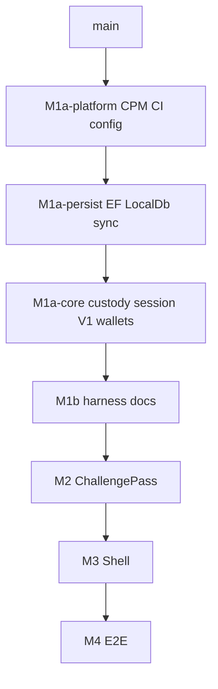

# MAUI review-stack reorganization (M1a split)

> **For humans / agents:** This is a **stack reorganization plan**, not an execution checklist of commits/pushes. Operational day-to-day rules stay in root `AGENTS.md` and `docs/BUILD_LOG.md`. Implement slices as separate stacked PRs; do not reintroduce agent-directed bash recipes into design docs.

**Goal:** Keep each PR under review-tool line budgets (~≤5–6k net churn preferred; hard fail near +10k) while preserving earliest-owning-layer landing (`platform → persist → core remainder → m1b → m2 → m3 → m4`).

**Architecture:** Carve today's oversized `prototype/maui-m1a` (#25) into reviewable stacked PRs. Later layers (ChallengePass / Shell / E2E) rebase onto the new Core tip once the Core stack is re-based.

**Tech stack:** .NET 10, CPM (`Directory.Packages.props`), StyleCop / Sonar, xUnit Core tests, formal branches `prototype/maui-m*`.

## Global constraints

- Fix smells on the **earliest** owning layer; merge upward.
- `dotnet test CipherBank-app.Tests` green on every Core slice tip.
- Shell Android build required when public Core surface moves (`dotnet build CipherBank-app -f net10.0-android`).
- No Expo / `design_handoff_cipherbank/` in MAUI PRs.
- Prefer **stack restack** (`rebase --onto`) over duplicating fixes on M4 tip.
- Review bots (Conman / Gifany / Cave) and Sonar `new_violations` must stay clear per tip.

---

## Target stack

| Order | Branch (proposed) | Replaces / feeds | Approx content | Review focus |
|-------|-------------------|------------------|----------------|--------------|
| 1 | `prototype/maui-m1a-platform` | First slice of #25 | CPM, props, editorconfig, Sonar workflow, `config/*`, structure script, csproj wiring | Packaging / CI only |
| 2 | `prototype/maui-m1a-persist` | Next | `Core/Persist/**`, Persist tests, DB options used by EF | Storage / SQL / EF |
| 3 | `prototype/maui-m1a` (slimmed) or `…-core` | Rest of #25 | Custody, Session, V1, Wallets, Services, Charts/Cora/… + tests | Domain behavior |
| 4 | `prototype/maui-m1b` | #26 | Harness / docs already parked here | Scripts + docs |
| 5–7 | `maui-m2` … `m4` | #21–#23 | Unchanged ownership | Rebase onto new Core tip |

If slice 3 still exceeds review tools, peel **V1** (+~2.3k) into `maui-m1a-product` between persist and custody/session, or after custody if wire clients depend on session types—prefer dependency order verified by compile.

## Slice 1 — Platform (this PR)

**In scope**

- `Directory.Packages.props`, `Directory.Build.props`
- `.editorconfig` / `.gitignore` (IDE0008 stays **suggestion** until Core mechanical)
- `.github/workflows/sonar.yml`
- `config/**`, `scripts/validate-structure.sh`
- CPM versionless PackageReferences on Core / Tests / Shell / Integration / E2E csproj
- Core `stylecop.json`, InternalsVisibleTo, embedded config links, forward package refs

**Out of scope**

- Domain code moves (Custody / Persist / V1)
- Raising IDE0008 to warning/error (Core mechanical slice)
- ChallengePass / Shell UI / E2E stories

**Done when:** Core + unit tests build green on `main` + platform tip; PR reviewable under line budget; Sonar/CI sane for packaging changes.

## Slice 2 — Persist (next)

**In scope:** `CipherBank-app.Core/Persist/**`, Persist tests, Configuration pieces required for DB/options, any `LocalDbSql` CA2100/S1309 handling.

**Done when:** Persist tests green; no Custody/V1 refactors beyond compile fixes.

## Slice 3 — Core remainder

**In scope:** Custody, Session, V1, Wallets, Services, Charts, Cora, Models, Animations, Pos, Compat tests, IDE0008 promotion to warning once `var` burn-down lands.

**Done when:** Full unit suite green; public API compatible with M1b→M4 or DIM/overload bridges documented.

## Restack procedure (when executing)

1. Land / merge Platform into the formal stack base (or keep stacked: Persist bases on Platform).
2. Rebuild Persist branch with `git rebase --onto <platform-tip> <old-base>`.
3. Rebuild slim Core from remaining #25 commits / path filters onto Persist tip.
4. `maui-m1b` → `m2` → `m3` → `m4`: `rebase --onto` each onto the new upstream tip; force-with-lease only with explicit approval.
5. Close or retarget #25 once the three Core slices supersede it; keep PR description map so reviewers know where comments moved.

## Review working model

- **One open “active review” PR** at the bottom of the unmerged Core stack (Platform first).
- Upper PRs stay draft or “do not review yet” until their base is reviewed.
- Bot threads: resolve on the slice that owns the file; do not duplicate fixes upward.
- Human nits that span slices: reply with pointer to owning PR; avoid drive-by edits on later tips.

## Risk notes

- CPM + new Core PackageReferences without Persist code: restore cost only; OK.
- Embedded config resources on Platform: required so later Core options binding can land without another props churn.
- IDE0008 softened on Platform: intentional; Core slice must promote severity after mechanical conversion or Sonar will regress.
- Shell Android compile gate still applies once Core public surface changes (slice 2/3), not for pure Platform.

## Success criteria

- [ ] Platform PR merged or stacked and reviewed under tool limits
- [ ] Persist + Core remainder each independently reviewable
- [ ] Formal M1b–M4 tips rebased onto new Core tip; CI green
- [ ] #25 either replaced by the slice PRs or reduced to a thin merge rollup
