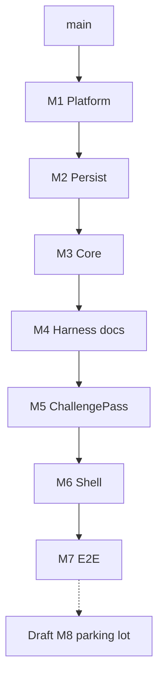

# MAUI review-stack reorganization (M1–M7 + draft parking)

> **For humans / agents:** Stack map and ownership only — not an agent bash recipe. Day-to-day rules: root `AGENTS.md`, `docs/BUILD_LOG.md`.

**Goal:** Reviewable stacked PRs under tool line budgets, with stable **M1…M7** numbering. Oversized historical M1a (#25) is split; former ChallengePass/Shell/E2E shift up. Post-stack feature work parks in a **draft** PR until the review stack lands.

**Architecture:** Earliest-owning-layer still wins. New Core slices are M1–M3; harness docs are M4; product layers formerly called M2–M4 become M5–M7.

**Tech stack:** .NET 10, CPM, StyleCop / Sonar, xUnit, Appium E2E; branches under `prototype/maui-m*`.

## Global constraints

- Fix on the earliest owning layer; merge / rebase upward.
- `dotnet test CipherBank-app.Tests` green on every Core tip (M1–M3).
- Shell Android build when public Core surface moves (from M3 upward into M6).
- No Expo / `design_handoff_cipherbank/` on MAUI stack PRs.
- Force-with-lease restacks only with explicit approval.
- Bot + Sonar `new_violations` clear per tip before inviting the next review.

---

## Numbering map (canonical)

| New | Role | Source (historical) | Branch (target) | PR notes |
|-----|------|---------------------|-----------------|----------|
| **M1** | Platform — CPM, Sonar, config, csproj wiring | `maui-m1a-platform` | `prototype/maui-m1` (or keep `…-platform` until rename) | #33; supersedes legacy #20 |
| **M2** | Persist — EF / LocalDb / sync | carve from #25 | `prototype/maui-m2` **after** old m2→M5 move | not cut yet |
| **M3** | Core remainder — custody, session, V1, wallets… | slim #25 | `prototype/maui-m3` **after** old m3→M6 move | replaces bulk of #25 |
| **M4** | Harness + docs | `maui-m1b` / #26 | `prototype/maui-m4` **after** old m4→M7 move | |
| **M5** | ChallengePass | former `maui-m2` / #21 | `prototype/maui-m5` | |
| **M6** | Cora Shell | former `maui-m3` / #22 | `prototype/maui-m6` | |
| **M7** | E2E | former `maui-m4` / #23 | `prototype/maui-m7` | |
| **Draft (M8 parking)** | Next features / cleanup prep | former M4+ + userdata + review docs | `prototype/maui-m8-draft` (from former m4-agentic) | draft only |

### Historical rename (do not mix in review comments)

| Old label | New label |
|-----------|-----------|
| M1a-platform | **M1** |
| M1a-persist | **M2** |
| M1a-core / slim #25 | **M3** |
| M1b | **M4** |
| M2 ChallengePass | **M5** |
| M3 Shell | **M6** |
| M4 E2E | **M7** |
| M4+ / agentic | **Draft parking (M8)** |

---

## Slice definitions

### M1 — Platform (landed as #33)

CPM (`Directory.Packages.props`), Build props, editorconfig (IDE0008 suggestion until M3 mechanical), Sonar workflow, `config/*`, structure script, csproj CPM wiring. No domain C#.

### M2 — Persist (next cut)

`CipherBank-app.Core/Persist/**` + Persist tests + DB options. Bases on M1.

### M3 — Core remainder

Custody, Session, V1, Wallets, Services, Charts/Cora/…, IDE0008 → warning after `var` burn-down. Bases on M2. If still over review budget, peel V1 as an optional Mid-stack PR (still before M4).

### M4 — Harness / docs

Former M1b: e2e scripts, lint harness, docs moved off Core tips.

### M5–M7 — Product layers

ChallengePass → Shell → E2E. Rebase onto M4 tip after Core stack is stable. **PR titles and bases update when branches are renamed**; until then titles may say “M5 (was M2)” etc.

### Draft parking (M8) — do not merge with the review stack

Single **draft** PR for cleanup and next-feature prep, stacked on **M7** (former M4 E2E tip). Collects:

1. Former **M4+ agentic** foundation (#32 templates / agentic scaffolding).
2. **feat(core): userdata client + TCP loopback (53809)** (#29), including its pack-crypto prerequisite (#28) when restacked.
3. **docs(reviews): PR_M1a–M4 vs stack comparison + adoption plan** (#31).

Purpose: one place to reconcile comparison notes, userdata wire work, and agentic templates **after** M1–M7 review — not an active review gate.

---

## Branch rename order (when executing renames)

Existing `prototype/maui-m2`…`m4` collide with new M2–M4 meanings. Rename **top-down** (free names from the tip):

1. `maui-m4` → `maui-m7` (update #23 base/head as needed).
2. `maui-m3` → `maui-m6` (#22).
3. `maui-m2` → `maui-m5` (#21).
4. `maui-m1b` → `maui-m4` (#26); base → new M3.
5. Cut / point `maui-m3` at slim Core; `maui-m2` at Persist; `maui-m1` at Platform (#33); close legacy #20 as superseded.
6. `maui-m4-agentic` → `maui-m8-draft`; convert to draft; fold userdata + comparison docs.

Force-with-lease required; coordinate so open review comments keep a pointer table in each PR body.

---

## Review working model

- Active review is the **lowest unmerged** stack PR (start: **M1**).
- Upper PRs draft or “wait” until their base is reviewed.
- Bot threads resolve on the owning Mn; no upward duplicate fixes.
- Draft M8 stays draft until M7 is ready to accept feature follow-ons.

## Success criteria

- [ ] Plan numbering matches PR titles (M1–M7 + draft parking)
- [ ] M1 reviewed / mergeable under line budget
- [ ] M2 Persist + M3 Core cut and independently reviewable
- [ ] Former ChallengePass/Shell/E2E retitled M5–M7 and rebased onto M4
- [ ] #25 closed or reduced to rollup once M1–M3 supersede it
- [ ] Single draft parking PR holds agentic + userdata (53809) + comparison docs
