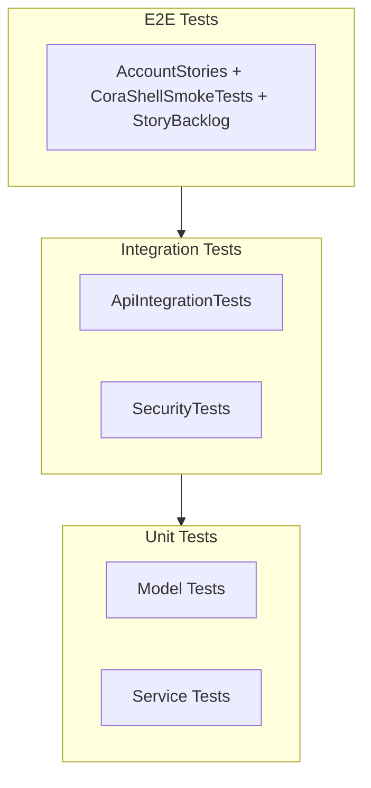

# Tests

CipherBank-app has three test projects following a test pyramid: unit tests (fast, many), integration tests (API behavior), and E2E tests (full user flows).

## Test Pyramid



## Frameworks

| Project | Framework | Assertions | Mocking |
|---------|-----------|------------|---------|
| CipherBank-app.Tests | xUnit | FluentAssertions | Moq |
| CipherBank-app.IntegrationTests | xUnit | FluentAssertions | WireMock |
| CipherBank-app.E2ETests | xUnit | FluentAssertions | Appium (design-spec Shell) |

Expo Playwright (`design_handoff_cipherbank/starter`) is the **contract lab** until Shell parity; then Appium owns full `CB-*` / `US-*` coverage — see [STORY_ID_MAP.md](STORY_ID_MAP.md).

`AccountStories` (`CipherBank-app.E2ETests/Tests/AccountStories.cs`) is the primary executable story
suite today: the Fresh-device account/onboarding Facts (`CB-ACCOUNT-001`, `US-ONB-03`, `US-ONB-04`,
`CB-ACCOUNT-PIN-CHANGE`, `CB-ACCOUNT-002`). `CoraShellSmokeTests` covers the sealed-device design-spec
smoke path; `StoryBacklogTests` lists the remaining `CB-*` catalog as skipped Theories.

**Operator runbook (emulator boot → build/install → Appium → tests):**
[CipherBank-app.E2ETests/README.md](../CipherBank-app.E2ETests/README.md)

## Running Tests

```bash
# All tests
dotnet test

# Unit tests only
dotnet test CipherBank-app.Tests

# Integration tests only
dotnet test CipherBank-app.IntegrationTests

# E2E inventory (no device)
dotnet test CipherBank-app.E2ETests --list-tests

# E2E smoke (requires Appium + device/emulator)
E2E_RUN=1 TEST_PLATFORM=android ANDROID_APK_PATH=path/to/app.apk \
  dotnet test CipherBank-app.E2ETests --filter "FullyQualifiedName~CoraShellSmokeTests"

# Or via the Android harness (boots the AVD, builds/installs the APK, starts Appium):
# --wave account runs all Wave 0-1 AccountStories Facts: CB-ACCOUNT-001, US-ONB-03, US-ONB-04,
# CB-ACCOUNT-PIN-CHANGE, CB-ACCOUNT-002 (see scripts/e2e-android.sh WAVE_STORY_PREFIXES).
./scripts/e2e-android.sh --wave account
```

## Coverage

- **Unit tests**: 70% threshold (line, branch, method). Cobertura output in `./coverage/`.
- **Integration tests**: Coverage collected, 0% threshold.
- **E2E tests**: Coverage collected.

## Related Documentation

- [unit-tests.md](unit-tests.md)
- [integration-tests.md](integration-tests.md)
- [e2e-tests.md](e2e-tests.md)
- [STORY_ID_MAP.md](STORY_ID_MAP.md) — CB-* / US-* ↔ Appium
