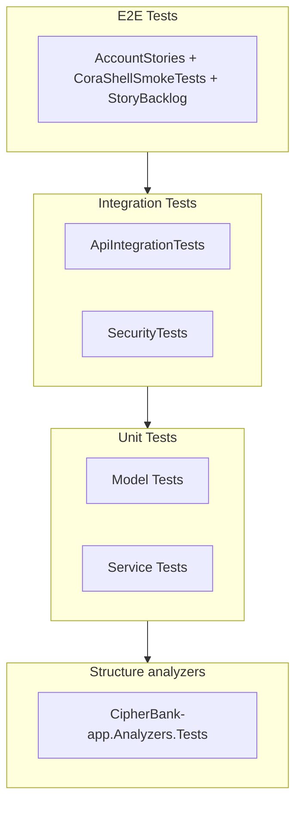

# Tests

CipherBank-app has four test projects following a test pyramid: structure
analyzer tests (compile-time rules), unit tests (fast, many), integration
tests (API behavior), and E2E tests (full user flows).

## Test Pyramid



## Frameworks

| Project | Framework | Assertions | Mocking |
|---------|-----------|------------|---------|
| CipherBank-app.Analyzers.Tests | xUnit | xUnit | Roslyn analyzer testing |
| CipherBank-app.Tests | xUnit | FluentAssertions | Moq |
| CipherBank-app.IntegrationTests | xUnit | FluentAssertions | WireMock |
| CipherBank-app.E2ETests | xUnit | FluentAssertions | Appium (design-spec Shell) |

Appium owns `CB-*` / `US-*` coverage on the shipping Shell — see [STORY_ID_MAP.md](STORY_ID_MAP.md) and [BUILD_LOG.md](../BUILD_LOG.md). Expo is out of the MAUI merge path.

`AccountStories` (`CipherBank-app.E2ETests/Tests/AccountStories.cs`) is the primary executable story
suite today: the Fresh-device account/onboarding Facts (`CB-ACCOUNT-001`, `US-ONB-03`, `US-ONB-04`,
`CB-ACCOUNT-PIN-CHANGE`, `CB-ACCOUNT-002`). `CoraShellSmokeTests` covers the sealed-device design-spec
smoke path; `StoryBacklogTests` lists the remaining `CB-*` catalog as skipped Theories.

**Operator runbook (emulator boot → build/install → Appium → tests):**
[CipherBank-app.E2ETests/README.md](../../CipherBank-app.E2ETests/README.md)

## Running Tests

```bash
# Structure analyzer tests
dotnet test CipherBank-app.Analyzers.Tests/CipherBank-app.Analyzers.Tests.csproj

# Unit tests only
dotnet test CipherBank-app.Tests/CipherBank-app.Tests.csproj /p:CollectCoverage=false

# Integration tests only
dotnet test CipherBank-app.IntegrationTests

# E2E inventory (no device)
dotnet test CipherBank-app.E2ETests --list-tests

# E2E smoke (requires Appium + device/emulator)
E2E_RUN=1 TEST_PLATFORM=android ANDROID_APK_PATH=path/to/app.apk \
  dotnet test CipherBank-app.E2ETests \
  --filter "Story=US-LCK-01|Story=US-HOM-05|Story=US-POS-01"

# Or via the Android harness (boots the AVD, builds/installs the APK, starts Appium):
# --wave account runs all Wave 0-1 AccountStories Facts: CB-ACCOUNT-001, US-ONB-03, US-ONB-04,
# CB-ACCOUNT-PIN-CHANGE, CB-ACCOUNT-002 (see scripts/e2e-android.sh WAVE_STORIES).
./scripts/e2e-android.sh --wave account
```

## Coverage

The coverage job in `.github/workflows/sonar.yml` publishes OpenCover for
Sonar (`new_coverage`) and Cobertura for tooling:

- **Analyzer tests**: Coverlet OpenCover on `CipherBank-app.Analyzers`
  (`reports/analyzer.opencover.xml`). No local threshold; Sonar's new-code
  coverage condition is the gate.
- **Unit tests**: Coverlet Cobertura + OpenCover
  (`reports/coverage.cobertura.xml`, `reports/coverage.opencover.xml`).
  Project file still records a 70% local threshold; CI passes
  `Threshold=0` and lets Sonar enforce new-code coverage.
- **Integration tests**: Coverage collected, 0% threshold. Not in the M1
  coverage job.
- **E2E tests**: Coverage collected. Not in the M1 coverage job.

The AI-review `cipherbank_coverage_report.txt` summary is an M4 harness
artifact, not produced on this slice.

## Related Documentation

- [unit-tests.md](unit-tests.md)
- [integration-tests.md](integration-tests.md)
- [e2e-tests.md](e2e-tests.md)
- [STORY_ID_MAP.md](STORY_ID_MAP.md) — CB-* / US-* ↔ Appium
