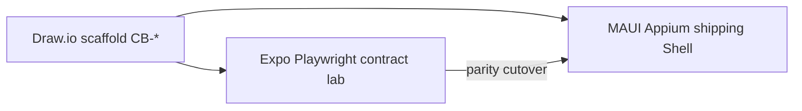

# Story ID map — MAUI Appium (design-spec E2E)

**Ownership:** Once Cora Shell reaches **Expo parity**, MAUI **Appium** (`CipherBank-app.E2ETests`) is the authoritative runner for the full design-spec user stories (`CB-*` / `US-*`).

Expo Playwright under `design_handoff_cipherbank/starter/e2e/` remains the **contract lab** until parity — same story IDs, different driver.



## Executable / partial Appium facts today

| Story IDs | Test method | Notes |
|-----------|-------------|--------|
| US-LCK-01, US-CNV-01, US-RCV-01 | `US_LCK_01_CNV_01_RCV_01_Unlock_ConvertQuote_ReceiveQr` | Needs `E2E_RUN=1` + APK |
| US-HOM-05, CB-MARKET-001, US-SND-01 | `US_HOM_05_SND_01_HomeChart_ConvertPickers_SendAch` | Chart chips + Send ACH surfaces |
| US-POS-01, CB-PAY-003 | `US_POS_01_CB_PAY_003_PosLabSimulate` | Soft-return if PosLab not on screen |
| CB-ACCOUNT-001 / US-ONB-01 | `CB_ACCOUNT_001_US_ONB_01_CreateAccount` | **Executable** — passed on `CipherBank_API34` (Task 7 canary); Welcome→Keys→Quiz→PIN→Home, procedure steps journaled |
| US-ONB-03 | `US_ONB_03_WrongQuizWords_BlocksAdvance` | **Executable** — passed on `CipherBank_API34` (Task 8); wrong backup-quiz words surface `BackupQuizErrorLabel` and block advance to SetPin |
| US-ONB-04 | `US_ONB_04_PinMismatch_BlocksSeal` | **Executable** — passed on `CipherBank_API34` (Task 8); confirm ≠ PIN surfaces `SetPinErrorLabel` and blocks seal; same Fresh-device fixture as CB-ACCOUNT-001 |
| CB-ACCOUNT-PIN-CHANGE | `CB_ACCOUNT_PIN_CHANGE_DynamicPin` | **Executable** — passed on `CipherBank_API34` (Task 9); Sealed → Profile → Security → Change PIN, journal `AlternatePin` promoted, replaced PIN rejected on Unlock, new PIN reaches Home. Covers the wrong-PIN-error half of US-LCK-02; lockout-after-N-fails still uncovered |
| CB-ACCOUNT-002 / US-ONB-02 | `CB_ACCOUNT_002_RecoverAccount` | **Executable** — passed on `CipherBank_API34` (Task 10); Sealed → Profile export (real `IMnemonicBackupService` file saved to Downloads) → `pm clear` → Welcome → Restore from backup → Android document picker → wrong password rejected → recovery password → SetPin → Home. Same custody proven by revealing the phrase on the recovered wallet through Profile's Vault card and comparing it with the pre-wipe phrase |

## Backlog

`StoryBacklogTests` lists remaining `CB-*` entries as skipped Theories. Catalog: `CipherBank-app.E2ETests/Stories/StoryCatalog.cs`.

## Expo testID ↔ MAUI AutomationId

See `Stories/AutomationIdMap.cs`. New controls should prefer **identical** strings where possible.

| Expo `testID` | MAUI `AutomationId` |
|---------------|---------------------|
| welcome-create | WelcomeCreateWalletButton |
| welcome-returning | WelcomeReturningButton |
| keys-continue | KeysContinueButton |
| quiz-continue | BackupQuizVerifyButton |
| pin-input / pin-confirm / pin-finish | SetPinEntry / SetPinConfirmEntry / SetPinSealButton |
| _(MAUI-only)_ change PIN | ProfileChangePinButton / ChangePinCurrentEntry / ChangePinEntry / ChangePinConfirmEntry / ChangePinSubmitButton |
| _(MAUI-only)_ export recovery file | ProfileBackupPasswordEntry / ProfileBackupPasswordConfirmEntry / ProfileBackupHintEntry / ProfileExportBackupButton |
| _(MAUI-only)_ restore from backup | WelcomeRestoreFromBackupButton / RestoreBackupPickFileButton / RestoreBackupFileStatusLabel / RestoreBackupPasswordEntry / RestoreBackupOpenButton / RestoreBackupErrorLabel |
| _(MAUI-only)_ reveal phrase | ProfileRevealMnemonicButton / ProfileMnemonicRevealLabel |

## Run

```bash
# Inventory (no device)
dotnet test CipherBank-app.E2ETests --list-tests

# Device smoke (sealed-wallet unlock path)
E2E_RUN=1 TEST_PLATFORM=android ANDROID_APK_PATH=/path/to/app.apk \
  E2E_TEST_PIN=123456 \
  dotnet test CipherBank-app.E2ETests --filter "FullyQualifiedName~CoraShellSmokeTests"

# Clean-install onboarding (DeviceState.FreshAsync clears app data before each Fact — no separate flag needed)
E2E_RUN=1 TEST_PLATFORM=android ANDROID_APK_PATH=/path/to/app.apk \
  dotnet test CipherBank-app.E2ETests \
  --filter "FullyQualifiedName~CreateAccount|FullyQualifiedName~PinMismatch|FullyQualifiedName~WrongQuizWords"

# Or via the harness (boots CB_AVD, builds/installs the APK, starts Appium):
./scripts/e2e-android.sh --story CB-ACCOUNT-001
./scripts/e2e-android.sh --story US-ONB-03
./scripts/e2e-android.sh --story US-ONB-04
./scripts/e2e-android.sh --story CB-ACCOUNT-PIN-CHANGE
./scripts/e2e-android.sh --story CB-ACCOUNT-002

# ...or all five Facts above in one run:
./scripts/e2e-android.sh --wave account
```

`CB-ACCOUNT-002` drives Android's own document picker. The recovery password comes from
`E2E_RECOVERY_PASSWORD` (default `Cb-Emu-Recovery-2026`, 12+ characters as the app requires), and the file the
app exports is pulled to `artifacts/e2e-recovery/` for diagnosis. Both that directory and
`artifacts/e2e-diagnostics/` (page-source dumps on unexpected screens) are gitignored.

Appium server: `http://localhost:4723`.

## Related

- [e2e-tests.md](./e2e-tests.md) — Appium env + AutomationId tables
- `design_handoff_cipherbank/starter/docs/STORY_ID_MAP.md` — Expo mirror
- `design_handoff_cipherbank/starter/docs/USER_STORIES.md` — procedures
- UserStories scaffold `docs/USER_STORIES.md` — Draw.io source of truth
